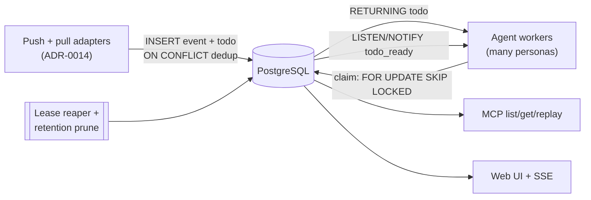
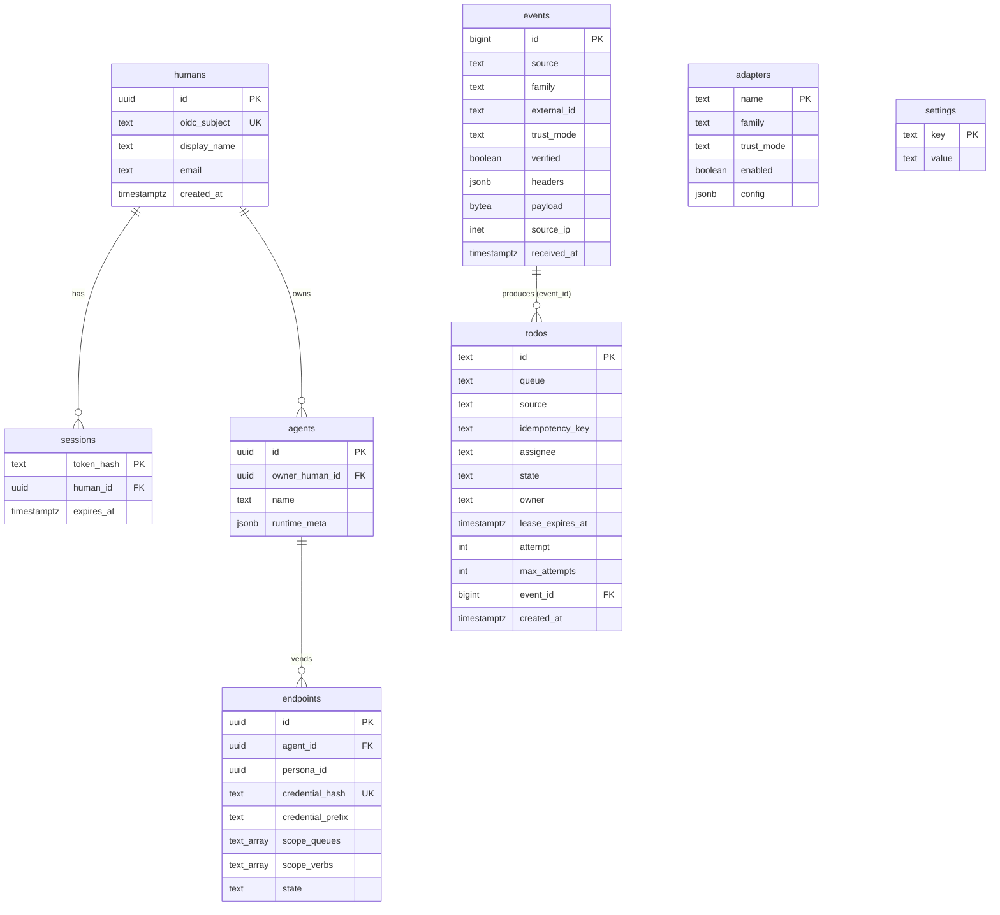

# Design: Persistence Layer

## Context

Switchboard is a self-hosted, multi-tenant service: one deployment serves many humans and many agent
personas. It verifies inbound events, turns them into a durable todo work-queue that competing agent
workers drain, and holds the relational metadata behind that (humans, agents, vended endpoints,
adapters, settings) plus an event history the MCP read tools and web UI expose. This capability
(SPEC-0004) is the datastore layer that all of that sits on. It realizes
[ADR-0002](../../../adrs/ADR-0002-postgres-persistence-and-retention.md).

The decisive constraint is that the hot path is a **concurrent job queue**, not an append-mostly log:
claim → lease → complete/retry with competing consumers, at-least-once + idempotent dedup, and a
store-then-ack coupling to pull ingestion (a pull adapter must persist a todo before it acks its
source). That shape drives every choice below and is what
[SPEC-0003 (todo-queue)](../todo-queue/spec.md) depends on.

The reference implementation already exists: `internal/db/db.go` (pool + migrator),
`internal/store/store.go` and `internal/store/todos.go` (typed data-access functions), and
`internal/db/migrations/0001_init.sql` (the schema this design describes).

## Goals / Non-Goals

### Goals

- One PostgreSQL database as the single system of record for all durable state.
- A thin, auditable raw-SQL data-access layer over `pgx` — typed functions, no ORM.
- Concurrent claimers with no thundering herd (`FOR UPDATE SKIP LOCKED`, owned by SPEC-0003).
- Transactional idempotent dedup (`INSERT … ON CONFLICT`) for both events and todos.
- Partial/expression indexes that keep the hot queue scan cheap regardless of terminal-row volume.
- A single static binary: migrations embedded and applied on startup, no external tool.
- Bounded growth via a hybrid age + row-cap retention policy.
- Optional in-DB wakeups (`LISTEN`/`NOTIFY`) that are a latency optimization, never a correctness
  dependency.

### Non-Goals

- Serving HTTP or MCP — this layer is consumed by other capabilities, it exposes no network surface.
- The full todo state machine and claim mechanics — those are SPEC-0003; this spec provides the
  storage primitives they use.
- A dedicated message broker — explicitly deferred until Postgres is demonstrably insufficient.
- Exactly-once delivery — the storage layer supports at-least-once + dedup; handlers stay idempotent.
- A secret manager — minted credentials are stored hashed in this same database.

## Decisions

### PostgreSQL over SQLite, a broker, or Redis-as-ledger

**Choice**: A single PostgreSQL database, accessed with raw SQL over `pgx`.
**Rationale**: A multi-tenant, multi-worker queue needs true concurrent claimers
(`SELECT … FOR UPDATE SKIP LOCKED`), transactional dedup/upsert, partial/expression indexes,
`jsonb`/array/`inet` types, `LISTEN`/`NOTIFY`, and a real HA/replication story — all native to
Postgres. A multi-node app tier connects to one database; a minimal deploy is one binary + one
Postgres.
**Alternatives considered**:
- SQLite: single-writer serializes every claim/heartbeat/complete; single-file/single-node is a SPOF
  with no shared app tier; no `SKIP LOCKED`.
- Dedicated broker (Kafka/Temporal/etc.): splits the source of truth from the durable todo ADR-0007
  made authoritative and re-implements lease/dead-letter/dedup that Postgres gives transactionally.
- Redis as ledger: conflates ingestion transport with storage and splits the trust/durability
  boundary; Redis stays a pull-ingestion transport only.

### Raw SQL over pgx, not a heavy ORM

**Choice**: A thin module of typed functions in `internal/store` over `pgx`, no ORM.
**Rationale**: The hot queue queries are hand-tuned SQL (`SKIP LOCKED`, partial-index `ON CONFLICT`,
the reaper `UPDATE`) that an ORM would obscure. Centralizing them keeps them auditable and the
dependency list short.
**Alternatives considered**:
- Heavy ORM: hides the exact queue SQL, adds a dependency, and offers little where every hot query is
  bespoke. Rejected.

### Embedded migrations applied on startup

**Choice**: `.sql` files embedded via `//go:embed`, applied in filename order, each in its own
transaction, tracked in `schema_migrations`.
**Rationale**: Keeps switchboard a single static binary with no external migration tool, and makes
application idempotent and atomic.
**Alternatives considered**:
- External migration tool (golang-migrate, Flyway): adds an operational dependency and breaks the
  single-binary posture. Rejected.

### Hybrid age + row-cap retention

**Choice**: Prune by max-age and max-row cap together, in one transaction, seeded from `settings`.
**Rationale**: Bounds both time and size; either bound alone leaves the other unbounded. Monthly
range partitioning of `events` can later turn pruning into a near-free `DROP PARTITION`.
**Alternatives considered**: none / age-only / row-cap-only — each leaves size or history unbounded.

## Architecture

The persistence layer is a pool + migrator (`internal/db`) plus a typed data-access module
(`internal/store`) over one PostgreSQL database. Producers (ingestion adapters, agents, switchboard
itself) write events and todos; agent workers claim and complete todos; a background reaper +
pruner maintain crash-safety and bounded growth; MCP read tools and the web UI read.

The schema as implemented in `0001_init.sql`:

Key storage primitives the rest of the system relies on:

- **`FOR UPDATE SKIP LOCKED` claims** — concurrent claimants each grab a *different* pending row,
  none blocking on another (implemented in `ClaimNext`, spec'd by SPEC-0003).
- **`INSERT … ON CONFLICT … DO NOTHING`** against the partial unique dedupe indexes — idempotent
  event insert (`InsertEvent`) and todo create (`CreateTodo`); an empty `RETURNING` means the
  existing row already covers the delivery.
- **Partial index `idx_todos_pending`** — the claim scan touches only live work.
- **The reaper `UPDATE`** — expired leases return to `pending` or dead-letter at the attempt cap.

## Risks / Trade-offs

- **Raw SQL has no compile-time schema check** → mitigated by centralizing every query in one small,
  tested data-access module and asserting the schema/indexes in migration tests.
- **An operated database to run/patch/back up** → accepted; it matches the hosted posture and doubles
  as the hashed-credential store, removing a separate secret-manager dependency.
- **Large raw `payload` rows in `events`** → mitigated by retention/partitioning and an optional
  payload-size cap (deferred).
- **`LISTEN`/`NOTIFY` is best-effort** → correctness never depends on it; a missed notify only costs
  latency because the durable queue is the source of truth.
- **Clock assumptions for leases** → lease/visibility timing is owned by SPEC-0003; this layer only
  stores `lease_expires_at` as `timestamptz` and compares against `now()` server-side.

## Migration Plan

The MVP schema ships as `internal/db/migrations/0001_init.sql`, applied automatically on first
startup by the embedded migrator. Future schema changes add new numbered `.sql` files (e.g.
`0002_*.sql`); the migrator applies any not yet recorded in `schema_migrations`, in order, each in
its own transaction. No down-migrations are supported by design — roll forward with a new migration.

## Open Questions

- **Event/todo seam** (from ADR-0007): whether events remain a separate read surface indefinitely or
  eventually become a sub-record of todos. The current schema keeps them distinct with `todos.event_id`
  referencing `events(id)`; this is left to confirm with Joe.
- **Event-log partitioning**: the ADR recommends monthly `PARTITION BY RANGE (received_at)` for
  high-volume deployments, but the MVP migration ships an unpartitioned `events` table. When and
  whether to introduce partitioning is deferred to an operational threshold.
- **The prune task**: ADR-0002 specifies hybrid retention and the `settings` defaults are seeded, but
  the periodic pruning implementation is not yet in the reviewed store package. The contract is fixed
  here; the scheduler wiring is a follow-up.
