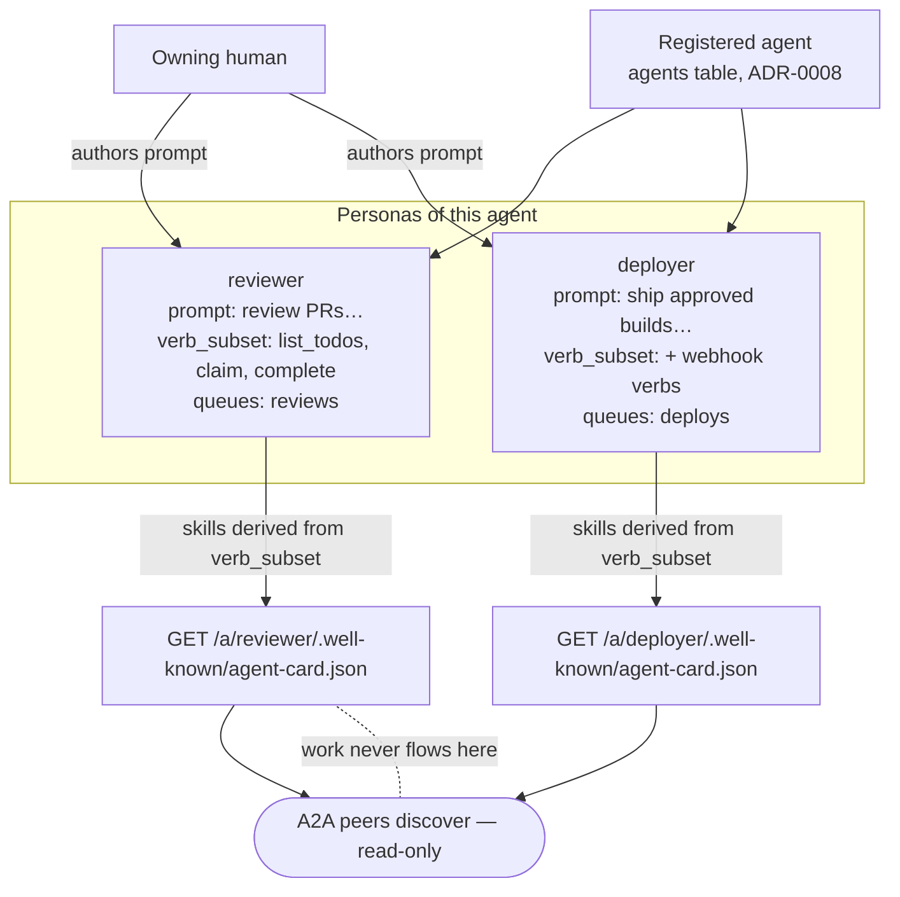
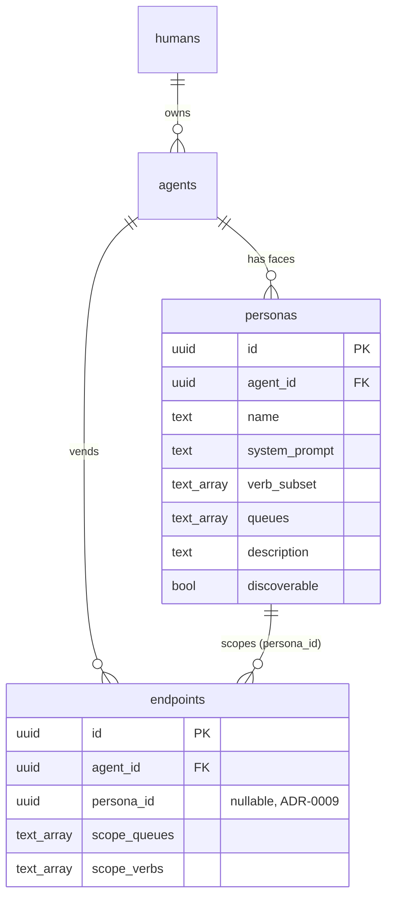

# Design: Personas as Scoped Agent Cards

## Context

Switchboard registers agents as lightweight owned records that grant nothing on their own; all power
comes from a **vended endpoint** — a URL + credential scoped to a set of queues and verbs
([ADR-0008](../../../adrs/ADR-0008-human-principal-vended-endpoints.md), realized in
`internal/store/agents.go` and `internal/agentapi/agentapi.go`). A single agent runtime, however, is
routinely used for several distinct jobs. Registering a separate agent per job duplicates the runtime
and severs the "same actor, different roles" relationship; handing one broad grant that covers every
job violates least privilege.

SPEC-0009 and [ADR-0009](../../../adrs/ADR-0009-personas-as-scoped-agent-cards.md) resolve this with
**personas**: named, scoped faces of one agent, each = base runtime + human-authored prompt + a subset
of the agent's vended verbs. Each persona is published as an [A2A](https://a2a-protocol.org/) Agent Card
so it is discoverable by any A2A-speaking peer, and its advertised skills are **derived** from its
vended verb subset so it can never claim a capability it does not hold.

The current codebase implements the agent/endpoint substrate but not personas: the `endpoints` table
carries a nullable `persona_id uuid` column (`internal/db/migrations/0001_init.sql`, commented
"ADR-0009; null = agent-level endpoint"), but there is **no `personas` table, no persona store code, no
Agent Card route, and no `/.well-known/agent-card.json` handler**. This spec is therefore grounded
primarily in the ADR and the contract doc `docs/specs/personas-and-agent-cards.md`, and it records the
implementation gap explicitly in Open Questions.

## Goals / Non-Goals

### Goals

- Define the persona record (agent + human-authored prompt + verb/queue subset) as the unit of
  capability scoping.
- Make advertised skills a pure function of the vended verb subset, so over-advertisement is
  structurally impossible.
- Publish each persona as a schema-valid A2A Agent Card at a per-persona well-known endpoint.
- Keep the card outward-only (discovery/announcement); no work-intake through it.

### Non-Goals

- Defining the friending/approval flow that consumes these cards — that is SPEC-0010
  ([ADR-0010](../../../adrs/ADR-0010-a2a-discovery-human-vended-friending.md)).
- Implementing A2A direct task delegation — deliberately excluded; work arrives as todos.
- Specifying the OIDC provenance mechanics of the owner identity chain — that is
  [ADR-0011](../../../adrs/ADR-0011-identity-assurance-oidc-passkey-deferred.md).

## Decisions

### Persona = agent + human prompt + verb subset

**Choice**: A persona is exactly three parts and no more: one `agent_id`, one human-authored
`system_prompt`, and a `verb_subset` (+ `queues`) that MUST be a subset of the agent's vended scope.
**Rationale**: Splits authorship cleanly — the human authors *behavior* (the prompt), the system
enforces *capability* (the subset). One agent can hold many minimal-scope faces without duplicating the
runtime.
**Alternatives considered**:
- One broad endpoint per agent, no personas: forces one grant to cover every job; behavior differences
  become invisible to switchboard. Rejected (opposite of least privilege).
- A separate registered agent per job: duplicates the runtime and severs shared owner/identity.
  Rejected.

### Skills are derived, never declared

**Choice**: Advertised `skills` are computed from `verb_subset` via an authoritative verb→skill map
maintained with the code; the card recomputes when the subset changes.
**Rationale**: Makes "what it says it does" ≡ "what it can do" a structural invariant rather than a
review checklist. A persona physically cannot advertise a skill outside its grant.
**Alternatives considered**:
- Hand-declared skills validated in review: drift-prone; a reviewer miss becomes an over-advertisement.
  Rejected.

### Per-persona well-known base path

**Choice**: Serve each card at `/a/{persona_id}/.well-known/agent-card.json`, giving every persona its
own base so the A2A-standard relative well-known path resolves to exactly one card.
**Rationale**: A2A mandates `/.well-known/agent-card.json`, but switchboard hosts many personas per
host. A per-persona base path keeps each card A2A-compliant relative to its base while disambiguating.
**Alternatives considered**:
- A single host-level card with an array of personas: not A2A-compliant; breaks peer tooling that
  expects one card at the well-known path. Rejected.
- Query-parameter disambiguation (`?persona=`): not the A2A well-known convention. Rejected.

## Architecture

A persona draws its capability slice from the agent's vended endpoint pool. Its Agent Card is a pure
projection of that slice (skills derived from verbs) plus owner provenance, served read-only at a
per-persona well-known path. The card is discovery-only; actual work always lands as todos through the
vended MCP endpoint, never through the card URL.

The persona record itself would be a new table joined to `agents`; the existing
`endpoints.persona_id` column is the hook that scopes a vended endpoint to a persona rather than to the
agent as a whole.

## Risks / Trade-offs

- **Persona proliferation** (many personas per agent, each auditable but numerous) → each persona's
  power is bounded and visible via its card; owner-controlled discoverability keeps the public surface
  small.
- **Verb→skill map maintenance** — the derivation depends on a map that must be kept current as verbs
  are added → keep the map authoritative in code with a test asserting derived skills are a function of
  the subset (adding/removing a verb changes the card).
- **Public card endpoint is an enumeration surface** → rate-limit per IP and only serve cards for
  owner-marked-discoverable personas; the card grants nothing even if scraped.

## Migration Plan

The persona substrate is a partial stub today: `endpoints.persona_id` exists, but the `personas` table,
store code, card route, and well-known handler do not. Realizing this spec requires:

1. A migration adding a `personas` table (and a `discoverable` flag) joined to `agents`, with
   `verb_subset`/`queues` subset-of-vended-scope enforced at write time.
2. Store methods mirroring `agents.go` (create/list/get-owned, subset validation against the agent's
   vended scope).
3. An Agent Card projector implementing the verb→skill map and the A2A card schema.
4. A read-only route mounted at `/a/{persona_id}/.well-known/agent-card.json` in
   `internal/server/server.go`, plus persona-management handlers in the human web UI (extending
   `agent.html`).

No data migration of existing rows is needed; `persona_id` is already nullable, so all current
endpoints remain valid agent-level grants.

## Open Questions

- **Not yet implemented.** There is no `personas` table, persona store code, verb→skill projector, card
  route, or well-known handler in the current tree. Only `endpoints.persona_id` (nullable) exists. The
  ADR + contract doc define the intended shape; this design records it and the gap.
- **Authoritative verb→skill map location.** The contract doc gives an illustrative map
  (`list_todos+claim+complete → process-work`, `create_for → delegate-work`, etc.); the canonical map
  must live in code with a covering test. Its exact grouping semantics (all-of vs any-of a verb group)
  are TBD.
- **Owner provenance on the card.** How much of the owner identity chain
  ([ADR-0011](../../../adrs/ADR-0011-identity-assurance-oidc-passkey-deferred.md)) to expose in the
  public `provider` field vs. reveal only after friending is an open privacy question.
- **Directory membership mechanics.** Whether "discoverable" is a boolean per persona or a per-directory
  membership is unresolved (interacts with SPEC-0010 bounded directories).
