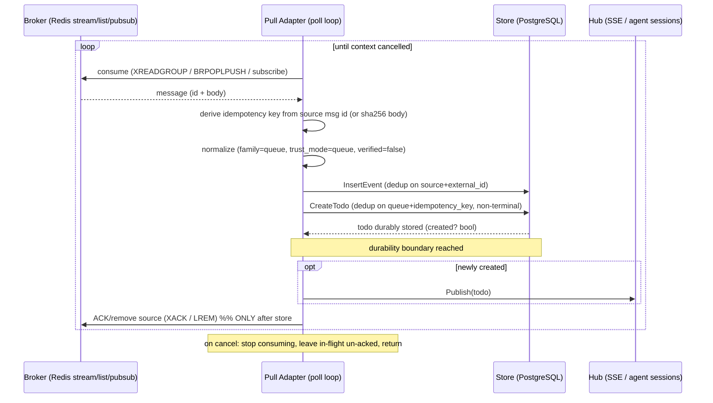

# Design: Queue Adapters (Pull Ingestion)

> **Retired 2026-09-21 (#181).** Pull ingestion was removed; see the note on
> [SPEC-0002](spec.md). Kept as history.

## Context

Switchboard ingests external deliveries and turns them into durable todos. This design realizes the
**pull** half of that pipeline — adapters that consume from an external broker — for SPEC-0002. It is
governed by two ADRs:

- [ADR-0014](../../../adrs/ADR-0014-ingestion-adapters-push-pull.md) generalizes ingestion into
  **adapters** with two families (push/pull) sharing one back-half contract, and pins the pull-only
  mechanic: **store-then-ack** (the source ack is coupled to the todo's durability). Redis is the
  reference pull adapter; SQS/NATS/AMQP extend the family with no model change.
- [ADR-0003](../../../adrs/ADR-0003-per-provider-ingestion-and-trust-model.md) fixes the `queue`
  trust mode: no per-message signature, trust is the broker connection (auth/ACL + TLS).

Current state: the shared back half exists — `store.InsertEvent` (dedup on `(source, external_id)`)
and `store.CreateTodo` (dedup on `(queue, idempotency_key)` among non-terminal rows) in
`internal/store/todos.go`, over the `events` and `todos` tables in
`internal/db/migrations/0001_init.sql`. The `adapters` table already carries `family` (`webhook` |
`queue`), `trust_mode`, `enabled`, and a `config` jsonb column, so a queue adapter has a registry row
and a runtime enable/disable flag. The push reference (`internal/ingest/ingest.go`) shows the back-half
call pattern this design consumes; no pull adapter is coded yet. The prose contract for the pull
family lives in `docs/specs/ingestion-adapters.md`, whose substance this design folds in. (Note:
`docs/specs/asyncapi.yaml` documents the *outbound* SSE stream, not queue ingestion — the pull-side
contract is prose + ADR-0014, and this design is authoritative for it.)

Constraints: a queue carries ack/redelivery semantics an HTTP webhook does not, so the pull family
must couple the source ack to the todo. Each adapter is a long-running worker with an explicit
lifecycle (startup + graceful shutdown) and context-propagated cancellation, distinct from the
request-scoped push receivers.

## Goals / Non-Goals

### Goals

- Consume from a broker and feed messages into the same back half push uses, so the two families
  cannot drift.
- Guarantee no work is lost at the transport boundary via store-then-ack.
- Prefer ack-capable Redis modes (streams + consumer group, reliable list) for durable work.
- Run each adapter as a race-safe worker with graceful shutdown and broker-error backoff.
- Extend to SQS/NATS/AMQP by adding an adapter, with no model change.

### Non-Goals

- Push (webhook) ingestion — that is SPEC-0001 (`webhook-ingestion`).
- The todo lifecycle after creation (claim / lease / complete / fail) — the todos capability.
- Broker provisioning, ACL setup, or TLS termination — operator/infra concern.
- The routing-rule schema — shared and referenced, not owned here.

## Decisions

### Store-then-ack (ack-on-store default)

**Choice**: Create and durably store the todo first; ack/remove the source message only after. A crash
between consume and store leaves the message un-acked ⇒ redelivered ⇒ deduped to one todo.
**Rationale**: The todo store *is* the durability boundary. Acking on consume would lose any message
whose todo never persisted (crash window). Coupling ack to durable store makes the todo's durability
the queue's ack and yields at-least-once + idempotent, matching the push family.
**Alternatives considered**:
- Ack on consume: rejected — loses messages in the consume→store crash window.
- Ack on todo *completion* (not just store): stronger end-to-end coupling but holds redelivery state
  longer; recorded as an open question, not the default.

### Idempotency key from source message id

**Choice**: Derive the key from the broker's native message id (Redis stream entry id) where present,
`sha256(body)` where absent (list, pub/sub), namespaced `redis:{name}:...`.
**Rationale**: The native id is the strongest redelivery-collapse signal and is exactly what makes
store-then-ack safe — a redelivered message derives the same key and dedups. Namespacing prevents
cross-source collisions.
**Alternatives considered**:
- Broker-agnostic body hash only: rejected — misses distinct messages with identical bodies and
  discards the reliable id the transport already provides.

### Prefer ack-capable Redis modes

**Choice**: Streams + consumer group (`XREADGROUP` … `XACK`) is the recommended durable mode; reliable
list (`BRPOPLPUSH` + `LREM`) is an acceptable alternative; pub/sub is fire-and-forget, documented
loss-tolerant only.
**Rationale**: Durable work needs per-message ack + redelivery on restart, which pub/sub cannot
provide. This resolves ADR-0003's deferred "pub/sub vs. consumer-group stream" question in favor of an
ack-capable mode.
**Alternatives considered**:
- Pub/sub as default: rejected — no redelivery, silently loses work on a crash.

### Adapter as a long-running worker with graceful shutdown

**Choice**: Each pull adapter runs its own context-scoped poll loop; on cancellation it stops
consuming, leaves in-flight-unstored messages un-acked, and returns cleanly.
**Rationale**: Pull is not request-scoped like push; it needs an explicit lifecycle so shutdown does
not lose in-flight work or leak goroutines, and so a broker blip backs off instead of crashing the
process.
**Alternatives considered**:
- Fire-and-forget goroutine with no lifecycle: rejected — no clean shutdown, leaks goroutines, risks
  acking work that shutdown interrupted.

## Architecture

A pull adapter runs the **front half** (transport consume + trust = connection) unique to the broker,
then the **shared back half** identical to the push family, and finally the **pull-only trailing ack**
gated on durable store.

The crash-safety property is the whole point of the ordering: a failure at any step **before** the
final `ACK` leaves the message un-acked, so the broker redelivers it and the idempotency key dedups it
to exactly one todo.

Redis transport modes and their ack primitive:

| Mode | Consume / ack | Redelivery | Use |
|------|---------------|-----------|-----|
| Streams + consumer group | `XREADGROUP` then `XACK` after store | per-message on restart | recommended for durable work |
| Reliable list | `BRPOPLPUSH` onto processing list, `LREM` after store | pending in processing list | acceptable alternative |
| Pub/sub | subscribe, no ack | none | loss-tolerant only, not for durable work |

## Risks / Trade-offs

- **Each new pull transport must map its own ack/redelivery primitive** (`XACK`, list `LREM`, SQS
  visibility timeout → `DeleteMessage`, NATS `ack`, AMQP `basic.ack`) → inherent to real queues;
  captured per-adapter, with the store-then-ack rule constant across all of them.
- **Pub/sub cannot guarantee delivery** → documented as loss-tolerant; ack-capable modes preferred and
  recommended for durable work.
- **A poll loop that mishandles shutdown could ack interrupted work or leak goroutines** → explicit
  context propagation, graceful-shutdown requirement, race detector in CI.
- **List/pub-sub body-hash keys collide across identical bodies** → accepted where the transport
  carries no id; stream mode (with entry ids) preferred for exactness.
- **Ack-on-store (not ack-on-complete) means a todo that later fails is not redelivered by the broker**
  → intended: todo failure/retry is the todos capability's lease/attempt model, not the broker's job.

## Migration Plan

Additive. The `adapters` table (`0001_init.sql`) already stores `family='queue'`, `trust_mode`,
`enabled`, and `config`, and the back half (`InsertEvent`, `CreateTodo`) is implemented and shared
with the push family. A queue adapter is a new long-running worker plus an `adapters` registry row; no
schema migration is required. Redis lands first as the reference; SQS/NATS/AMQP are later additions
under the same interface.

## Open Questions

- **Ack-on-store vs. ack-on-complete** (from ADR-0014): the default is ack-on-store; whether any
  adapter should defer the source ack until todo *completion* for stronger end-to-end coupling — at
  the cost of holding broker redelivery state through the entire todo lifecycle — is unresolved.
- Whether event-insert and todo-create should be a single database transaction (strict atomicity)
  versus gating ack on the todo write alone; the store currently exposes them as separate calls.
- Where per-adapter broker config (DSN, stream/consumer-group names, mode) lives long-term — the
  `adapters.config` jsonb column versus environment/config — is deferred; connection secrets stay in
  environment/config regardless.
- Backoff/retry policy specifics (initial delay, max delay, jitter) for transient broker errors are
  left to the implementation.
