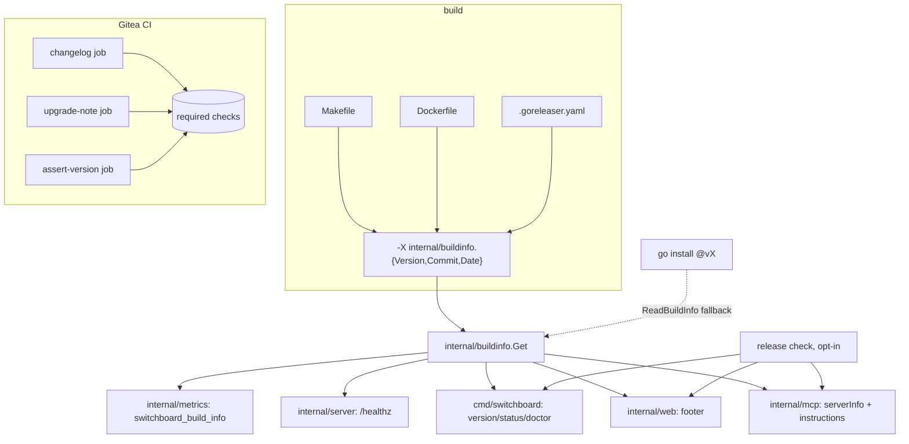

# Design: Release, Version Reporting and Upgrade Contract

## Context

The binary already knows its version. The release workflow asserts that
`switchboard version` contains the tag, after a wrong `-X` path once produced "dev" binaries that
passed. But `main.version` is read only by the `version` verb. MCP sends a hardcoded `"0.1.0"`
(`internal/mcp/mcp.go`), `/healthz` answers `ok`, and the footer shows a tagline.

`v0.2.0` was 22 commits behind `main` on 2026-09-22. The commits in between include #291, which removed the
environment-seeded receivers and ran the irreversible migration `0021_drop_adapters`, with no
CHANGELOG and no upgrade note. Nothing on `main` reads the retired `SWITCHBOARD_*_SECRET`
variables, so a customer who still sets them gets silence.
[ADR-0032](../../../adrs/ADR-0032-release-version-reporting-and-upgrade-contract.md) decides the
contract. Governing spec: SPEC-0027.

## Goals / Non-Goals

### Goals

- One stamped version, visible on every surface.
- A breaking change cannot merge without its upgrade note.
- Until 1.0, superseded surfaces are removed outright and named in the upgrade note; nothing warns
  at runtime.
- Docs readers know what is released.
- `v0.3.0` ships under the contract.

### Non-Goals

- Versioned docs per release (deferred to 1.0).
- Automatic upgrades or in-product upgrade flows.
- A default-on update check.
- Changing the release channels. Gitea goreleaser produces binaries and the release, and GitHub
  Actions produces the ghcr image, as today.

## Decisions

### `internal/buildinfo` replaces `main.version`

**Choice**: a leaf package with three variables and a `Get()` that applies the
`debug.ReadBuildInfo` fallback once, with `sync.Once`. Every surface calls `buildinfo.Get()`.

**Rationale**: `main` cannot be imported, so any other package that wants the version needs it
threaded through constructors. `serverVersion` is a literal precisely because nobody threaded it.
A leaf package removes the threading, and the fallback makes `go install @vX` builds truthful with
no ldflags at all.

**Alternatives considered**:
- Pass `version` through `server.Config`: works, but every new surface repeats the plumbing, and
  `internal/mcp` would still be free to use a literal.

### Three stamps, one assertion script

**Choice**: `scripts/assert-version.sh <binary> <tag>` builds nothing. It:

1. runs `version`;
2. starts `serve` against a throwaway Postgres with `SWITCHBOARD_DEV_LOGIN=1` and a random port;
3. curls `/healthz`;
4. posts an MCP `initialize` with a dev-vended credential;
5. checks all three contain the tag.

`release.yaml` calls it, and so does a CI job on `main` with `VERSION=v0.0.0-ci`, so a broken
stamp is caught before a tag.

**Rationale**: the existing assertion proves one surface. The failure it was written for, a stamp
that "injects nothing and still exits 0", applies to every surface, so every surface gets asserted.

### `/healthz` stays probe-compatible

**Choice**: the plain body `ok <version>\n` by default, and JSON on `Accept: application/json`.

**Rationale**: existing probes check the status code, or a body that starts with `ok`. Appending
the version after a space keeps both working. JSON is for `doctor` and humans.

### CHANGELOG enforcement is a small, local script

**Choice**: `scripts/check-changelog.sh`, run by a `changelog` job and an `upgrade-note` job in
`.gitea/workflows/ci.yaml`. It reads the PR title and labels from the event payload, and runs
`git diff origin/main...HEAD` for the file changes. Rules:

| Title type | CHANGELOG `[Unreleased]` line | `upgrading.md` + `### Breaking` |
|---|---|---|
| `feat`, `fix`, `sec`, `perf` | required | — |
| any type with `!:` | required | required |
| new migration with `DROP TABLE`/`DROP COLUMN`/`DELETE FROM` | required | required |
| `docs`, `toil`, `test`, `chore`, `chore(deps)` | not required | — |
| label `no-changelog` | waived (visible in review) | not waivable |

**Rationale**: the rules must be readable by the person they block, and runnable locally
(`make changelog-check`). A marketplace action would hide the rules and add a supply-chain pin.

**Gitea caveat**: reusable workflows lose the event context (a known Gitea behaviour), so the
job reads the PR title in the calling workflow and passes it down as an input, rather than reading
`github.event` inside a callee.

### No retired-variable table; the upgrade note is the notice

**Choice**: a retired environment variable, setting, verb or route is deleted in the PR that
supersedes it. There is no `internal/config/retired.go`, no startup warning and no alias. The
`upgrade-note` job's checklist asks the author to name every removed surface and its replacement.

**Rationale**: Joe, 2026-09-22: "pre-1.0 … Just nuke it." A warning table is a back-compat surface
that grows with every removal and has to be maintained until someone decides it may shrink. The
upgrade note already has to exist (REQ-10), so it carries the same information at no runtime cost.

**Alternatives considered**:
- A retired-variable table with one startup `WARN` per variable still set: the earlier draft of this
  design, rejected by the decision above.

### Docs banner and `:::unreleased`

**Choice**: `build-docs.mjs` reads the latest tag (`git describe --tags --abbrev=0`) and the HEAD
commit, and exposes them to Docusaurus as `customFields.release`. A swizzled `DocItem/Layout`
wrapper renders the banner. `:::unreleased` is a custom admonition registered in the theme config.
At release, a script (`scripts/release-docs.sh vX.Y.Z`) rewrites `:::unreleased` to `:::since` with
the version. The docs build fails on a tagged commit that still contains `:::unreleased`.

**Rationale**: this gives most of the honesty of versioned docs at the cost of one component and
one script. Readers see at a glance what they cannot use yet.

**Coupled fix**: `docs.yaml` has no `pull_request` trigger and skips every step when
`REGISTRY_TOKEN` is unset (#245). REQ-12 needs a PR-time build, so the story that implements the
banner also closes #245.

### Release check against public tags

**Choice**: `GET https://api.github.com/repos/stump-wtf/switchboard/tags?per_page=100`, following
`Link: rel="next"` for up to 10 pages (the endpoint is paged and not sorted by version), parsed with
`golang.org/x/mod/semver`, keeping the highest tag with no prerelease suffix. Opt-in only. It
retries daily and holds the result in memory.

**Rationale**: the GitHub copy is the public mirror, and tags reach it by push mirror. The tags
endpoint needs no auth and exists whether or not a GitHub Release object was created (Gitea
creates the canonical release, and GitHub gets the ghcr image). The request is anonymous, and 60
requests an hour per IP is far above one a day.

## Architecture



### Instruction text

```
switchboard v0.3.0 (built 2026-09-24)
[This Switchboard build is more than 90 days old. Features described in current docs may be missing. Tell your human to check for an upgrade.]
[v0.4.0 is available.]
Todos routed to you arrive as <channel source="switchboard"> doorbell events …   ← existing text
```

### `upgrading.md` skeleton

```markdown
# Upgrading

## Upgrading to v0.3.0

### Breaking: environment-seeded receivers removed (#291)
**Who is affected:** any deployment that set SWITCHBOARD_{GITHUB,GITEA,STRIPE,SLACK}_SECRET or
SWITCHBOARD_LEGACY_RECEIVER_ENDPOINT_ID, or that delivers to POST /webhooks/<provider>.
**What happens if you do nothing:** those variables are ignored, with no warning, and deliveries
to /webhooks/<provider> return 404.
**Back up first:** migration 0021_drop_adapters drops the adapters table and cannot be reversed.
  pg_dump --format=custom --file=switchboard-pre-v0.3.0.dump "$SWITCHBOARD_DATABASE_URL"
**Steps:** for each sender, have the owning agent call create_webhook (or use the vend wizard),
paste the returned ingest_url and signing_secret into the sender, then remove the old variables.
**Verify:** send a test delivery; list_todos shows it;
  env | cut -d= -f1 | grep -E '^SWITCHBOARD_((GITHUB|GITEA|STRIPE|SLACK)_SECRET|LEGACY_RECEIVER_ENDPOINT_ID)$'
prints nothing.
```

## Risks / Trade-offs

- **CHANGELOG conflicts.** → One bullet per line, and frequent releases keep `[Unreleased]` short.
  Rebasing a conflict in a list is trivial.
- **The `no-changelog` label gets abused.** → It is visible in review, and it cannot waive an
  upgrade note.
- **The 90-day heuristic misfires.** → The wording is conditional ("may be missing"), and the
  opt-in check is exact.
- **The version is public on `/healthz`.** → An accepted disclosure (open source, public
  releases), with `SWITCHBOARD_HIDE_VERSION` as the opt-out.
- **A docs banner computed from `git describe` needs tags in the CI checkout.** → The docs job uses
  `fetch-depth: 0` and fetches tags. The build fails loudly when no tag is found, rather than
  printing an empty version.

## Migration Plan

1. `internal/buildinfo`, the stamps and the assertion script (smallest change, fixes MCP at once).
2. Surfaces: `/healthz`, the footer, the instructions line, the CLI and the metric.
3. CHANGELOG back-fill, and the `changelog` and `upgrade-note` CI jobs made required.
4. Docs banner, `:::unreleased`, and the PR-time docs build (closes #245).
5. Cut `v0.3.0`: move `[Unreleased]`, write the upgrade section, tag, and verify every surface
   reports `v0.3.0`.
6. The staleness warning and the opt-in release check.

Steps 1 to 3 are prerequisites of `v0.3.0` only in the sense that `v0.3.0` should be the first
release that reports itself correctly. If a security fix needs a release first, cut it with the
CHANGELOG and upgrade note written by hand, and let the contract catch up.

## Open Questions

- **Should the release check default to on?** Resolved (design review 2026-09-22): no. It stays off by default (ADR-0032, option D),
  so Switchboard never phones home unless the operator opts in.
- **Should `/healthz` include the version by default?** Resolved (design review 2026-09-22): yes, with `SWITCHBOARD_HIDE_VERSION` as
  the opt-out (REQ-5).
- **Should Harness and Cairn adopt the same contract?** Resolved (design review 2026-09-22): yes, each in its own repository. This
  ADR is written to be portable, and each product records its own adoption.
