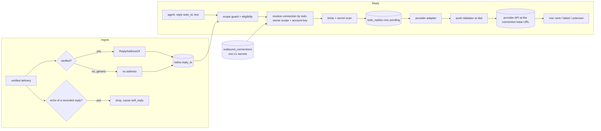

# Design: Reply to Source

## Context

[SPEC-0028](spec.md) gives todos a reply address and agents a `reply` verb that posts with an
owner-scoped connection. The pieces it builds on already exist:

* `routing.SubjectOf` (`internal/routing/subject.go`) parses a subject from the verified body in Go,
  after verification and before the todo write, in `internal/ingest/selfmanaged.go`. The address is
  derived at the same point, by the same kind of code.
* `internal/cred` seals held secrets with AES-256-GCM (`enc:v1:`), and `store.sealSecret` /
  `store.openSecret` already wrap it for webhook signing secrets.
* `internal/push.Validator` rejects private, loopback and link-local targets and re-resolves at dial
  time; ADR-0029's notify hooks are its first caller, this is the second.
* The MCP scope guard, verb families (`internal/mcp/verbs.go`) and per-slug token bucket
  (`internal/mcp/ratelimit.go`) are reused unchanged.

Ownership is the owning human today, and exactly one of human or team once ADR-0038 and SPEC-0033
(Teams and tenancy) land. This design writes the owner columns in that shape from the start.

## Goals / Non-Goals

### Goals

- An address fixed by verified provenance and stored on the todo row.
- Agents answer without ever holding, seeing or choosing a credential. An agent granted the
  off-by-default connection verbs can store one, and still never reads one back.
- One outbound credential vault, owner-scoped and write-only, that SPEC-0029's notification sinks reuse.
- Exactly-once posting from the caller's point of view, with honest `unknown` when the provider cannot
  tell us.
- Our own replies never become new work.

### Non-Goals

- Posting anywhere other than the origin, in this spec. A target-choosing `post_message` is deferred,
  not refused: if built, it is its own verb family, off by default, never in the basics vend, and
  usable only through a connection with a non-empty targets allowlist.
- Reading from providers (fetching thread history, reactions). Agents that need that use their own
  tools.
- Editing or deleting a posted reply. A correction is another reply.
- Linear and Plain addresses: added with their source kinds (SPEC-0032).
- Human-facing notifications. That is SPEC-0029.

## Decisions

### Derive the address next to the subject, in Go

**Choice**: a `routing.ReplyAddressOf(source, headers, body, verified bool) *ReplyAddress` beside
`SubjectOf`, called once per delivery in `SelfManaged`, its JSON passed into `CreateTodoParams` so the
single transaction that writes the event and all fan-out todos writes the address too.

**Rationale**: the subject parser already reads these exact fields for issues and Cairn artifacts, and
it already refuses to let tenant jq influence anything that keys behaviour. The address has the same
trust requirement.

**Alternatives considered**:
- Derive at reply time from the stored payload: rejected, because a parser change would silently move
  old todos' targets, and the verification verdict would have to be re-read.
- Let a routing action set the address: rejected, because rules are tenant-written jq over
  sender-controlled bodies (ADR-0024).

### `generic` never gets an address

**Choice**: `ReplyAddressOf` returns nil unless `verified` is true, which is never the case for a
token-trust webhook.

**Rationale**: an address is a promise to spend a credential. Token trust authenticates the caller only
by URL possession, so an address parsed from the body would let anyone with the URL aim the owner's
token. The vend wizard can create a signed forge webhook instead.

### One connection vault, shared with sinks

**Choice**: a table `outbound_connections` with a `kind` column. This spec defines `github`, `gitea`,
`slack`, `cairn`; SPEC-0029 adds `gotify` and `apprise` rows to the same table and the same management
surface.

**Rationale**: the rules are the same for every outbound credential: owner scope, mandatory encryption,
write-only, fingerprint, test, audit. Writing them twice is how one copy ends up weaker.

**Alternatives considered**:
- Credentials on the endpoint: rejected, because endpoints are immutable grants (ADR-0008) and a
  credential shared by all of an owner's endpoints would have to be copied into each.
- Credentials in the operator's environment: rejected, because they would belong to no tenant, which is
  the shape the shared-receiver removal took out.

### Resolution by exact account key, not by best match

**Choice**: unique `(owner scope, kind, account_key)`; resolution is one indexed lookup, then the
allowlists.

**Rationale**: "pick the most specific connection" invites ambiguity bugs. Exactly one candidate, or a
refusal, is easy to reason about and to test.

### Write the row first, dial second

**Choice**: `INSERT ... ON CONFLICT (todo_id, idempotency_key) DO NOTHING RETURNING`, then dial only if
this call inserted. The row starts `pending`; the dial result updates it to `sent`, `failed` or
`unknown`.

**Rationale**: the row lock is the exactly-once point across instances. A crashed instance leaves a
`pending` row; a sweeper marks rows `pending` for more than 60 seconds as `unknown`, never retrying
them, because a provider might have accepted the post.

### Echo suppression on provider object ids

**Choice**: each sent reply records `provider_object_id` (forge comment id, Slack `channel:ts`, Cairn
comment id). The ingest path looks up `(owner scope, provider, provider_object_id)` in reply rows from
the last 24 hours before routing; a hit drops with cause `self_reply`. Slack also records the
connection's `bot_id` from `auth.test` and drops events carrying it.

**Rationale**: suppression keyed on the exact object we created cannot hide a human's message. A
sender-login check alone would drop real work if the connection's identity is a human account.

### The verb lives in its own family

**Choice**: `ReplyVerbs() = ["reply"]` and `ConnectionVerbs() = ["list_connections",
"create_connection", "rotate_connection", "delete_connection"]`, both included in `AllVerbs()` so the
vend wizard, quick vend and consent screen enumerate them (their chips default to the drain verbs, so
they start unchecked). A new `BasicVerbs()` returns `AllVerbs()` without those two families, and the
operator API's basics vend (`internal/server/api.go`, which grants `AllVerbs()` verbatim today)
switches to it. SPEC-0032's `set_webhook_secret` is not excluded: Joe decided on 2026-09-22 that it
is granted wherever `create_webhook` is, the basics vend included. `TestAllVerbsComposesFamilies`
(`internal/mcp/verbs_test.go`) pins `AllVerbs()` to the three existing families; widening it to the
new ones is part of the story that adds them, and leaving `reply` out of `AllVerbs()` to keep it green
would break the wizard and consent enumeration.

**Rationale**: posting publicly as the owner, and holding the owner's outbound credentials, are
different powers from draining. Both are available to agents, and both are off until an owner grants
them (Joe, 2026-09-22: risky options are fine when they are configurable and off by default).

## Schema

The migration number is the next free one when the story lands; other work in flight also adds
migrations.

```sql
ALTER TABLE todos ADD COLUMN reply_to jsonb;

CREATE TABLE outbound_connections (
    id                  uuid PRIMARY KEY DEFAULT gen_random_uuid(),
    owner_human_id      uuid REFERENCES humans(id) ON DELETE CASCADE,
    owner_team_id       uuid,          -- FK to teams(id) once SPEC-0033's table exists
    kind                text NOT NULL, -- github|gitea|slack|cairn (+ gotify|apprise, SPEC-0029)
    name                text NOT NULL,
    account_key         text NOT NULL, -- host | base URL | Slack team id
    secret              text NOT NULL, -- enc:v1: ciphertext only; refused when no key
    secret_fingerprint  text NOT NULL, -- first 12 hex of sha256(secret)
    config              jsonb NOT NULL DEFAULT '{}', -- allowlists, signature line, provider ids
    created_by_human_id uuid NOT NULL REFERENCES humans(id),
    created_at          timestamptz NOT NULL DEFAULT now(),
    rotated_at          timestamptz,
    last_used_at        timestamptz,
    last_test           jsonb,         -- {at, ok, class}
    CHECK (num_nonnulls(owner_human_id, owner_team_id) = 1)
);
CREATE UNIQUE INDEX outbound_connections_account
    ON outbound_connections (COALESCE(owner_human_id, owner_team_id), kind, lower(account_key));
CREATE UNIQUE INDEX outbound_connections_name
    ON outbound_connections (COALESCE(owner_human_id, owner_team_id), name);

CREATE TABLE todo_replies (
    id                  uuid PRIMARY KEY DEFAULT gen_random_uuid(),
    todo_id             text NOT NULL REFERENCES todos(id) ON DELETE CASCADE,
    endpoint_id         uuid NOT NULL,
    connection_id       uuid REFERENCES outbound_connections(id) ON DELETE SET NULL,
    connection_name     text NOT NULL,
    connection_fp       text NOT NULL,
    owner_scope_id      uuid NOT NULL,
    address_kind        text NOT NULL,
    address_display     text NOT NULL,
    idempotency_key     text NOT NULL,
    text                text NOT NULL,
    text_sha256         text NOT NULL,
    state               text NOT NULL, -- pending|sent|failed|unknown
    error_class         text,
    error_code          text,
    provider_object_id  text,
    permalink           text,
    created_at          timestamptz NOT NULL DEFAULT now(),
    finished_at         timestamptz,
    UNIQUE (todo_id, idempotency_key)
);
CREATE INDEX todo_replies_echo
    ON todo_replies (owner_scope_id, address_kind, provider_object_id)
    WHERE provider_object_id IS NOT NULL;
```

`reply_to` shape, by kind:

```json
{"kind": "slack_thread", "team_id": "T0123", "channel": "C0123", "thread_ts": "1726990000.000100",
 "display": "slack C0123 thread 1726990000.000100"}
{"kind": "forge_comment", "provider": "gitea", "host": "gitea.example.net",
 "repo": "stump.wtf/switchboard", "number": 482, "display": "gitea stump.wtf/switchboard#482"}
{"kind": "cairn_comment", "instance": "https://cairn.example.net", "artifact_id": "sSpOSXZs",
 "display": "cairn sSpOSXZs"}
```

## MCP Surface

```json
{"name": "reply",
 "description": "Post text to the conversation this todo came from (its reply_to). You choose the words; the destination and credential are fixed by switchboard. The text is posted publicly.",
 "inputSchema": {"type": "object", "required": ["todo_id", "text"], "properties": {
   "todo_id": {"type": "string"},
   "text": {"type": "string", "maxLength": 16384},
   "idempotency_key": {"type": "string", "maxLength": 128}}}}
```

Result:

```json
{"reply_id": "…", "state": "sent", "duplicate": false,
 "display": "gitea stump.wtf/switchboard#482",
 "permalink": "https://gitea.example.net/stump.wtf/switchboard/pulls/482#issuecomment-99001"}
```

`todoOut` additions:

```json
{"reply_to": {"kind": "forge_comment", "display": "gitea stump.wtf/switchboard#482"},
 "replies": {"count": 2, "last_state": "sent", "last_permalink": "…"}}
```

Doorbell `meta` gains `"reply_to": "forge_comment"`. The instructions string gains one sentence: "If a
doorbell carries reply_to, you may answer the origin with the reply tool, passing its todo_id; the text
is posted publicly."

## Operator API and Web UI

```
GET    /api/v1/connections                  list (no secrets; fingerprint, last_test, last_used_at)
POST   /api/v1/connections                  {owner, kind, name, account_key, secret, config}
PATCH  /api/v1/connections/{id}             {name?, config?}           (no secret field)
PUT    /api/v1/connections/{id}/secret      {secret}                   (rotate; 204)
DELETE /api/v1/connections/{id}
POST   /api/v1/connections/{id}/test        -> {ok, class, identity}
```

`owner` is `{"human": "me"}` or `{"team": "<slug>"}`. A connection outside the caller's scopes answers
`404`. The web UI mirrors this under **Settings → Connections** (and the team's settings page once
SPEC-0033 adds one), with a password-type input that is never pre-filled.

## Package Layout

```
internal/outbound/            connection store wrapper, resolution, rate limits
internal/outbound/provider/   one adapter per kind: github.go gitea.go slack.go cairn.go
internal/routing/reply.go     ReplyAddressOf + field validators
internal/mcp/reply.go         the verb, error mapping, todoOut additions
internal/web/connections.go   pages
internal/server/api.go        routes
```

An adapter is `Post(ctx, conn Credential, addr ReplyAddress, text string) (Result, error)` plus
`Test(ctx, conn Credential) (Identity, error)`. It receives the base URL from the connection, never
from the address, and builds its path from the validated address fields.

## Architecture



## Risks / Trade-offs

- **A tenant credential that can write to third parties now lives in Switchboard.** → Envelope
  encryption is mandatory, surfaces are write-only, resolution is scope-bound, and the target is fixed
  by verified provenance. A process-plus-key compromise still yields the secrets; the docs say so.
- **Provider API drift.** → Four small adapters behind one interface, each with a contract test against
  recorded fixtures; `test` surfaces a broken credential before a reply needs it.
- **`unknown` outcomes.** → Honest by design: we will not risk a double post. The permalink is absent,
  and the agent can check the thread with its own tools if it matters.
- **Echo suppression misses** (a provider that does not echo the object id we recorded). → The per-todo
  cap bounds the loop; the gap would show as `self_reply` never appearing on the events view.
- **Owners surprised that `generic` gets no replies.** → The vend wizard explains it and offers the
  signed webhook.

## Migration Plan

Additive. `todos.reply_to` is nullable, so existing todos simply have no address. The new tables are
empty until a human creates a connection. Nothing changes for an endpoint without the `reply` verb.
Rollback: drop the verb from the verb list (tools disappear), leave the columns.

## Open Questions

- **Should the grace window after `complete` be per owner?** Resolved (design review 2026-09-22): no, as proposed. It is an
  instance-wide default, with a per-connection override only if someone asks.
- **Should `complete` and `fail` take an optional `reply` field?** Resolved (design review 2026-09-22): no for v1, as proposed. Two
  calls keep each outcome independently recorded, and Harness can make both on the worker's behalf.
- **GitHub Apps.** Resolved (design review 2026-09-22): v1 accepts personal and fine-grained tokens. An App credential kind (private
  key plus installation id, minting a token per call) is a follow-up.
- **Do `generic` webhooks get a reply address?** Resolved (design review 2026-09-22): no. Their body is unsigned, so an address
  parsed from it cannot be trusted to aim the owner's credential (REQ-1).
