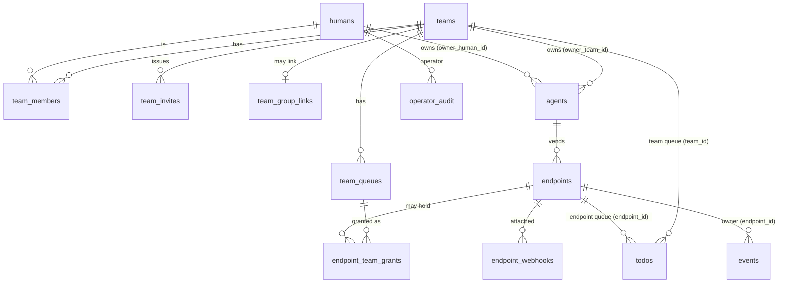
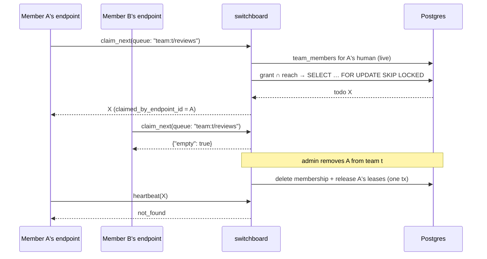

# Design: Teams and Tenancy

## Context

[ADR-0008](../../../adrs/ADR-0008-human-principal-vended-endpoints.md) made the human the tenant and
[ADR-0022](../../../adrs/ADR-0022-endpoint-scoped-todo-ownership.md) made todos endpoint-owned. What
never existed is a way for two humans to own something together, or a definition of the person who
runs the instance. [ADR-0038](../../../adrs/ADR-0038-teams-and-tenancy.md) adds both: teams as a
second kind of owner, and the operator as an instance role that owns nothing. This document covers
how. The normative requirements are in [spec.md](spec.md).

Facts from `main` @ `8474757` this design rests on:

* `humans(id, oidc_subject UNIQUE, …)` is the principal; there is no role, group or team column
  anywhere, and OIDC requests only `openid profile email` (`internal/auth/auth.go:92`).
* `agents.owner_human_id` is the only direct owner column on the endpoint chain; endpoints reach
  their human through `agent_id`.
* `todos.endpoint_id` is `NOT NULL`, and queues are an implicit `(endpoint_id, name)` namespace
  (`0012_endpoint_scoped_todos.sql`). There is no queues table.
* `events` has no owner column; `webhook_id` is nullable and `ON DELETE SET NULL`
  (`0018_event_routing.sql:19-21`), which is why #194 has no clean filter today.
* Every board handler already passes `human.ID` into the store (#176, #177). The MCP path does not
  have an equivalent for events, rules or routes: those authorize against the endpoint's human.
* `settings` is an instance key/value table read by retention, replay and SSE; nothing writes it.

## Goals / Non-Goals

### Goals

- One owner model every resource, present and in flight, can state in one line.
- A reach predicate that makes an unscoped query something a test catches, not a reviewer.
- Teams that people create, join and leave without the operator.
- Team queues drained competitively by several humans' agents, with immediate revocation.
- An operator role that is real, bounded and audited.
- Close #194 and the twenty other findings, each with a failing-first tenancy case.

### Non-Goals

- Nested teams, team-of-teams, or an organisation layer above teams.
- Per-resource ACLs, or sharing one resource with one outside human (friending covers that).
- Syncing teams between Switchboard and Cairn. The two products keep separate stores.
- Human work assignment. Team queues are for agents; human notification is ADR-0034's sinks, not a
  ticketing system.
- Moving the operator's hands off the database. The product removes its easy paths only.

## Decisions

### Two nullable foreign keys, not a polymorphic owner

**Choice**: directly owned tables get `owner_human_id` and `owner_team_id`, each a real foreign key
with `ON DELETE CASCADE`, and `CHECK (num_nonnulls(owner_human_id, owner_team_id) = 1)`.

**Rationale**: referential integrity and cascades come from Postgres for free, a partial index per
column keeps both lookups cheap, and the constraint makes "owned by nothing" and "owned by both"
unrepresentable. The companion records (sinks, credentials, provider secrets) copy the same three
lines.

**Alternatives considered**:
- `owner_kind text, owner_id uuid`: no foreign key, so no cascade and no integrity; a typo in
  `owner_kind` is a silent orphan.
- A separate `owners` table that humans and teams both reference: one more join on every hot query
  for no gain over two columns.

### Attached resources inherit, so ownership is decided in one place

**Choice**: webhooks, routes, rules, rule-pack installs, notify hooks, presence and endpoint-queue
todos carry no owner columns. Their owner scope is their endpoint's, and an endpoint's is its
agent's: `agents.owner_human_id` or `agents.owner_team_id`, exactly one.

**Rationale**: an endpoint is the unit of capability (ADR-0008). If its webhooks could be owned
separately, a team endpoint could hold a personal webhook, and the question "who may rotate this"
would need two answers.

### Reach is a value, compiled into SQL

**Choice**: a `store.Reach` value built once per request and passed to every tenant store method:

```go
type Reach struct {
    HumanID   string              // the acting human (or the endpoint's accountable human)
    Endpoint  *EndpointGrant      // non-nil on the agent path: the vend grant to intersect
    Teams     map[string]TeamRole // team_id -> role, from team_members at request time
    Operator  bool                // instance console only; never widens a tenant read
}
```

A helper renders the predicate as a parameterized join, for example for todos:

```sql
WHERE (t.endpoint_id = ANY($reach_endpoints)
       OR (t.team_id = ANY($reach_teams) AND (t.team_id, t.queue) IN (SELECT … FROM $grant)))
```

`$reach_endpoints` and `$reach_teams` are computed from `Reach` in Go; SQL never string-builds them.

**Rationale**: #194 and F4 are both "a query without a predicate". Making `Reach` a required
parameter turns that into a compile error for new code. A structure test (extending
`internal/server/tenancy_events_stream_test.go`) lists every exported store method and fails on any
that touches a tenant table without taking `Reach`, unless it carries the `Unscoped` suffix and is on
the allowlist (ingest token lookup, the lease reaper, retention, metrics gauges, migrations).

**Alternatives considered**:
- Postgres row-level security keyed on a session variable: strong, but every pooled connection must
  set and reset it, the reaper and ingest need a bypass role, and the tests become harder to read.
  Worth revisiting once `Reach` has settled which queries exist.

### Membership is read live, per request

**Choice**: `Reach.Teams` is loaded at the start of every MCP call and `/api/v1` request, and cached
only for that request:

```sql
SELECT m.team_id, max(m.role) FROM team_members m
  JOIN teams t  ON t.id = m.team_id  AND t.suspended_at IS NULL
  JOIN humans h ON h.id = m.human_id AND h.suspended_at IS NULL
 WHERE m.human_id = $1
 GROUP BY m.team_id;   -- a manual and a group-sourced row resolve to the higher role
```

(`max(role)` stands for "highest of owner > admin > member"; the implementation orders by an explicit
rank, not text.)

**Rationale**: SPEC-0033 REQ "Membership Changes Take Effect Immediately". One indexed lookup per
call is cheap next to the MCP round trip; a per-session cache would make removal eventually
consistent, which is exactly the property the rule exists to deny.

### Team queues: `todos.team_id`, a small `team_queues` table, and grant rows

**Choice**:

* `todos.endpoint_id` becomes nullable, with `todos.team_id` and the `todos_one_owner` check.
* `team_queues(team_id, name)` records the queues a team has, so a grant can be validated and a
  member can list them. Endpoint queues stay implicit.
* A personal endpoint's team-queue grants live in `endpoint_team_grants(endpoint_id, team_id,
  queue)`, not in the `scope_queues text[]`, so a team slug rename never breaks a grant and a
  removed team's grants cascade away.
* `todos.claimed_by_endpoint_id` records the lease holder for team todos (the existing `owner` column
  is the lease-holder string and stays as it is).

**Rationale**: the `(endpoint_id | team_id, queue)` pair is the queue identity every companion record
keys on (admission, digests, rule-pack targets, attempts). A queues table for endpoint queues too
would be cleaner, but it would be a migration across every endpoint for no tenancy gain; it can come
later if admission control (ADR-0035) needs rows for endpoint queues.

**Alternatives considered**:
- A synthetic "team endpoint" that owns every team todo, with members' endpoints friended onto it:
  reuses the endpoint model, but a friend edge is a cross-tenant grant and would carry ADR-0010's
  semantics (and F3's bug) into what is meant to be shared ownership.

### Team-queue doorbells pick one session

**Choice**: when a team todo passes the sender gate, the doorbell hub picks, among live sessions on
eligible clocked-in endpoints, the one rung least recently, and rings it. Notify hooks fire only for
team-owned endpoints of the same team.

**Rationale**: ADR-0013 rings one session per todo. Ringing every member's agent for every team todo
would turn a burst into N model turns per todo, and the claim would still go to one.

### Invites are hashed tokens bound to an email

**Choice**: `team_invites(id, team_id, email_lower, role, token_sha256, invited_by, expires_at,
accepted_at, revoked_at)`; 32 random bytes, base64url; accepted only by a session whose
provider-verified email equals `email_lower`.

**Rationale**: an email is the one identifier both login providers verify and both products share,
so an invite means the same thing in Cairn. Binding to the email, not to possession of the link,
means a leaked invite link is useless to anyone else.

### The operator is configuration, the console is small

**Choice**: `SWITCHBOARD_OPERATORS` (comma-separated `<issuer>|<subject>`) and
`SWITCHBOARD_OPERATOR_GROUP`. `/operator` shows the directory with counts, per-owner ceilings,
suspensions and the enrollment policy in effect. Every action writes `operator_audit` in the same
transaction.

**Rationale**: there is no operator row to manage because the operator is whoever deploys, and they
already hold the environment. Matching on session provenance (`sessions.issuer`, `provider_sub`, from
0020) rather than `humans.oidc_subject` keeps the format identical to Cairn's and survives F15's
re-keying of humans.

### Events get an owner at ingest

**Choice**: `events.endpoint_id` and `events.team_id` (exactly one, for rows written after the
migration), set at ingest from the resolved webhook's endpoint or, for a human-authored todo on a team
queue, the team. Backfill joins `webhook_id → endpoint_webhooks.endpoint_id`. The dedup index becomes
`(endpoint_id, source, external_id)` (F14).

**Rationale**: inferring an event's owner through `webhook_id` breaks when a webhook is deleted and
through todos breaks for dropped deliveries (F20). An owner column written once at ingest has
neither failure.

### Enrollment is an operator-configured mode, not a list of people

**Choice**: `SWITCHBOARD_ENROLLMENT_MODE = allowlist | invite | open`, defaulting to `invite` when
GitHub login is configured and `open` otherwise; an unknown value fails startup. The mode gates only
the creation of a `humans` row, for every provider. `SWITCHBOARD_ENROLLMENT_ALLOW` feeds `allowlist`.
Both names, their values and their semantics are identical in Cairn (`CAIRN_ENROLLMENT_MODE`,
`CAIRN_ENROLLMENT_ALLOW`, stump.wtf/cairn#265).

**Rationale**: F2 is what makes every other finding internet-reachable. Joe decided on 2026-09-22 that
the mode is operator config ("This should be configurable."), with `invite` as the default when GitHub
login is configured. Invite-only enrollment is the natural gate once teams exist: a new person arrives
because a team invited them. `open` stays the default for an OIDC-only instance, where the IdP already
decides who exists.

## Architecture





## Schema

Migration `0022_teams_and_tenancy.sql` (number to be confirmed against `main` at implementation):

```sql
CREATE TABLE teams (
    id           uuid PRIMARY KEY DEFAULT gen_random_uuid(),
    slug         text NOT NULL UNIQUE CHECK (slug ~ '^[a-z0-9]+(-[a-z0-9]+)*$' AND length(slug) BETWEEN 3 AND 40),
    display_name text NOT NULL,
    created_by   uuid REFERENCES humans(id) ON DELETE SET NULL,
    suspended_at timestamptz,
    created_at   timestamptz NOT NULL DEFAULT now()
);
CREATE TABLE retired_team_slugs (slug text PRIMARY KEY, retired_at timestamptz NOT NULL DEFAULT now());

CREATE TABLE team_members (
    team_id    uuid NOT NULL REFERENCES teams(id) ON DELETE CASCADE,
    human_id   uuid NOT NULL REFERENCES humans(id) ON DELETE CASCADE,
    role       text NOT NULL CHECK (role IN ('owner','admin','member')),
    source     text NOT NULL DEFAULT 'manual' CHECK (source IN ('manual','oidc_group')),
    added_by   uuid REFERENCES humans(id) ON DELETE SET NULL,
    added_at   timestamptz NOT NULL DEFAULT now(),
    PRIMARY KEY (team_id, human_id, source)
);
CREATE INDEX idx_team_members_human ON team_members (human_id);

CREATE TABLE team_invites (
    id           uuid PRIMARY KEY DEFAULT gen_random_uuid(),
    team_id      uuid NOT NULL REFERENCES teams(id) ON DELETE CASCADE,
    email_lower  text NOT NULL,
    role         text NOT NULL CHECK (role IN ('owner','admin','member')),
    token_sha256 bytea NOT NULL UNIQUE,
    invited_by   uuid REFERENCES humans(id) ON DELETE SET NULL,
    expires_at   timestamptz NOT NULL,
    accepted_at  timestamptz,
    revoked_at   timestamptz
);

CREATE TABLE team_group_links (
    team_id    uuid PRIMARY KEY REFERENCES teams(id) ON DELETE CASCADE,
    group_name text NOT NULL,
    role       text NOT NULL CHECK (role IN ('admin','member')),
    linked_by  uuid REFERENCES humans(id) ON DELETE SET NULL
);

CREATE TABLE team_queues (
    team_id    uuid NOT NULL REFERENCES teams(id) ON DELETE CASCADE,
    name       text NOT NULL,
    created_by uuid REFERENCES humans(id) ON DELETE SET NULL,
    PRIMARY KEY (team_id, name)
);

-- Agents (and so their endpoints): exactly one owner. Accountability on the endpoint.
ALTER TABLE agents ALTER COLUMN owner_human_id DROP NOT NULL;
ALTER TABLE agents
    ADD COLUMN owner_team_id uuid REFERENCES teams(id) ON DELETE CASCADE,
    ADD CONSTRAINT agents_one_owner CHECK (num_nonnulls(owner_human_id, owner_team_id) = 1);
ALTER TABLE endpoints
    ADD COLUMN vended_by_human_id uuid REFERENCES humans(id) ON DELETE SET NULL;

CREATE TABLE endpoint_team_grants (
    endpoint_id uuid NOT NULL REFERENCES endpoints(id) ON DELETE CASCADE,
    team_id     uuid NOT NULL,
    queue       text NOT NULL,
    PRIMARY KEY (endpoint_id, team_id, queue),
    FOREIGN KEY (team_id, queue) REFERENCES team_queues(team_id, name) ON DELETE CASCADE
);

-- Todos: exactly one owner.
ALTER TABLE todos ALTER COLUMN endpoint_id DROP NOT NULL;
ALTER TABLE todos
    ADD COLUMN team_id                uuid REFERENCES teams(id) ON DELETE CASCADE,
    ADD COLUMN claimed_by_endpoint_id uuid REFERENCES endpoints(id) ON DELETE SET NULL,
    ADD CONSTRAINT todos_one_owner CHECK (num_nonnulls(endpoint_id, team_id) = 1);
CREATE INDEX idx_todos_team_pending ON todos (team_id, queue, created_at) WHERE state = 'pending' AND team_id IS NOT NULL;
CREATE UNIQUE INDEX idx_todos_team_dedupe ON todos (team_id, idempotency_key)
    WHERE team_id IS NOT NULL AND idempotency_key IS NOT NULL AND state <> 'done'
      AND (state <> 'failed' OR next_retry_at IS NOT NULL);

-- Events: an owner written at ingest (F1, F14, F20).
ALTER TABLE events
    ADD COLUMN endpoint_id uuid REFERENCES endpoints(id) ON DELETE CASCADE,
    ADD COLUMN team_id     uuid REFERENCES teams(id) ON DELETE CASCADE;
UPDATE events e SET endpoint_id = w.endpoint_id FROM endpoint_webhooks w WHERE e.webhook_id = w.id;
-- New rows: CHECK (num_nonnulls(endpoint_id, team_id) = 1) added NOT VALID, validated once the
-- unowned legacy rows have aged out through retention.

CREATE TABLE operator_audit (
    id           bigserial PRIMARY KEY,
    operator_id  uuid REFERENCES humans(id) ON DELETE SET NULL,
    target_human uuid REFERENCES humans(id) ON DELETE SET NULL,
    target_team  uuid REFERENCES teams(id) ON DELETE SET NULL,
    action       text NOT NULL,
    reason       text NOT NULL CHECK (length(reason) > 0),
    detail       jsonb NOT NULL DEFAULT '{}',
    at           timestamptz NOT NULL DEFAULT now()
);

ALTER TABLE humans ADD COLUMN suspended_at timestamptz;
```

Directly owned tables added by the companion records (sinks, outbound credentials, provider
secrets) carry the three owner lines from ADR-0038 section 2.

## API

Human routes (session or human OAuth). Errors use the existing `{"error": {"code", "message"}}`
envelope.

```http
POST /api/v1/teams
{"slug": "stump", "display_name": "Stump family"}
→ 201 {"slug": "stump", "display_name": "Stump family", "role": "owner"}

POST /api/v1/teams/stump/invites
{"email": "bro@example.com", "role": "member"}
→ 201 {"id": "…", "email": "bro@example.com", "role": "member", "expires_at": "…",
       "link": "https://switchboard.example/invites/<token>"}   # link shown once

PATCH /api/v1/teams/stump/members/<human_id>
{"role": "admin"}                                             # passkey session required
→ 200 {"human_id": "…", "role": "admin", "source": "manual"}

PUT /api/v1/teams/stump/group-link
{"group": "family", "role": "member"}                         # owner; group must be held
→ 200
```

Error codes introduced: `team_ceiling_reached`, `role_required`, `role_ceiling`, `last_owner`,
`passkey_session_required`, `grant_out_of_scope`, `reference_out_of_scope`, `route_out_of_scope`,
`group_not_held`, `endpoint_suspended`, `replay_target_required`.

## MCP

No new verbs. Changes to existing ones:

| Verb | Change |
|---|---|
| `list_todos`, `claim`, `claim_next`, `create_todo`, `get_todo` | `queue` accepts `team:<slug>/<name>`; team todos include `"owner": {"team": "<slug>"}` |
| `heartbeat`, `complete`, `fail` | succeed only for `claimed_by_endpoint_id` on team todos |
| `whoami` | adds `"team_queues": ["team:stump/reviews", …]` from effective reach |
| `list_webhook_events`, `get_webhook_event`, `replay_webhook_event`, `switchboard://events/recent` | filtered by reach (F1); replay needs an owned target or a validated URL (F9) |
| `set_webhook_rules`, `test_webhook_rules`, route verbs | authorize against the webhook's own endpoint (F3, F19) |

Team management is not an MCP surface (SPEC-0033 REQ "Human API for Teams").

## Configuration

| Variable | Default | Meaning |
|---|---|---|
| `SWITCHBOARD_OPERATORS` | empty | comma-separated `<issuer>\|<subject>` of operators |
| `SWITCHBOARD_OPERATOR_GROUP` | empty | OIDC group whose members are operators |
| `SWITCHBOARD_ENROLLMENT_MODE` | `invite` with GitHub configured, else `open` | who may become a user: `allowlist`, `invite` or `open` |
| `SWITCHBOARD_ENROLLMENT_ALLOW` | empty | `<issuer>\|<subject>`, emails, `@domain`, `github-org:<login>` for `allowlist` |
| `SWITCHBOARD_MAX_TEAMS_PER_HUMAN` | `10` | teams one human may own |
| `SWITCHBOARD_OIDC_GROUPS_CLAIM` | empty (sync off) | claim name to read groups from; adds the scope on login |
| `SWITCHBOARD_RETENTION_EVENTS_PER_OWNER` | `50000` | per-owner event cap (F6) |
| `SWITCHBOARD_RETENTION_TODOS_PER_OWNER` | `50000` | per-owner terminal-todo cap (F6) |

Removed outright: the `replay_default_target` and `replay_allowed_targets` settings (F9). The migration
deletes their rows; there is no boot warning. The CHANGELOG `### Breaking` entry and the upgrade note
(SPEC-0027) name them.

## Audit Findings

The findings SPEC-0033 REQ "Closing the Audited Surfaces" binds to, from `main` @ `8474757`. File and
line citations are in ADR-0038 section 9.

| # | Surface | Fix | Requirement |
|---|---|---|---|
| F1 | Event history tools and resource (#194) | owner column on events; reach filter; replay checks first | Owner-Scoped History Reads |
| F2 | Open GitHub enrollment | enrollment policy | Enrollment Policy |
| F3 | Friend endpoints carry the approver's authority | friend grants limited; verbs authorize on the webhook's endpoint | Closing the Audited Surfaces |
| F4 | `KnownQueues` | reach filter | Closing the Audited Surfaces |
| F5 | Shared rule sandbox fails open | per-owner fair share; trust rules fail closed | Closing the Audited Surfaces |
| F6 | Instance-wide retention caps | per-owner caps | Per-Owner Retention |
| F7 | Ingest limiter keyed on proxy address | trusted proxy (#299) and per-webhook limiter | Per-Webhook Ingest Limits |
| F8 | Passkey gate unimplemented | #259 | Consent-Grade Team Actions |
| F9 | Instance replay targets bypass SSRF | owned targets, no bypass | Owned Replay Targets |
| F10 | Live lane frames to everyone (#184) | frames carry the webhook's owner | Closing the Audited Surfaces |
| F11 | Tenant queue names in metrics | `__tenant__` aggregation | Closing the Audited Surfaces |
| F12 | Anonymous OAuth client registry | redirect origin on consent | Closing the Audited Surfaces |
| F13 | Global friend-request uniqueness | humans in the key | Closing the Audited Surfaces |
| F14 | Global event dedup | owner in the key | Closing the Audited Surfaces |
| F15 | Humans keyed on raw `sub` | `(issuer, subject)` | Closing the Audited Surfaces |
| F16 | `/dev/todos` outside auth | session and reach | Closing the Audited Surfaces |
| F17 | Uncalled id-only store functions (#184) | `Reach` or `Unscoped` | Reach and Effective Reach |
| F18 | Old wakeup fallback reads by queue name | removed | Closing the Audited Surfaces |
| F19 | Route and rule verbs authorize on the human | the webhook's endpoint | Closing the Audited Surfaces |
| F20 | Route-target routing trace (#191) | redacted across scopes | Closing the Audited Surfaces |
| F21 | Instance feature flags and encryption key | accepted as instance policy | — |

## The Contract for Companion Records

| Record | Resource | Owner under this spec | Who writes it |
|---|---|---|---|
| SPEC-0024 / ADR-0029 | notify hooks | attached to the endpoint | endpoint verbs; team admins on the board |
| ADR-0031 | trusted-actor lists, quarantined deliveries | attached to the webhook | as webhooks; members read quarantine |
| ADR-0033 | reply-to-source credentials | direct, human or team | human; team admins; chosen by the todo's scope |
| ADR-0034 | notification sinks, digest schedules | direct / the queue's scope | human; team admins |
| ADR-0035 | admission budgets | the queue's scope `(endpoint_id or team_id, queue)` | human; team admins |
| ADR-0036 | rule-pack installs; pack catalog | attached to the webhook; catalog is code | as webhooks |
| ADR-0037 | provider secrets | direct, human or team | human; team admins; write-only |
| ADR-0039 | attempt history | the event's owner (`events.endpoint_id` or `events.team_id`) | ingest only; read by reach |

## Consistency with Cairn

| | Switchboard (this spec) | Cairn (its SPEC-0023) |
|---|---|---|
| Profiles | operator, user | operator, user |
| Operator config | `SWITCHBOARD_OPERATORS`, `_OPERATOR_GROUP` | `CAIRN_OPERATORS`, `_OPERATOR_GROUP` |
| Operator entry format | `<issuer>\|<subject>` | `<issuer>\|<subject>` |
| Enrollment | `SWITCHBOARD_ENROLLMENT_MODE` = `allowlist` \| `invite` \| `open`; `_ENROLLMENT_ALLOW`; default `invite` with GitHub login, else `open`; gates new users only | identical with `CAIRN_` prefix (stump.wtf/cairn#265) |
| Roles | owner, admin, member | owner, admin, member |
| Invites | email-addressed, 7 days, single-use, hashed, verified-email match, role ≤ inviter | identical |
| Group sync | `SWITCHBOARD_OIDC_GROUPS_CLAIM`; owner links; member or admin; login-time; GitHub never syncs | identical with `CAIRN_` prefix |
| Direction of flow | into a team, never out (routes) | into a team, never out (artifact moves) |
| Stores | Switchboard Postgres | Cairn Postgres |

A person in team `stump` in both products has two memberships, one per store. With group sync on,
both follow the same IdP group at the next login in each product; without it, an admin invites them
in each. What they see is the same model twice: the same role gives the same kind of power (use,
configure, govern) over each product's resources, and nothing in one product changes the other.

## Risks / Trade-offs

- **A todo without an endpoint breaks assumptions.** Doorbell, presence, notify hooks, metrics and
  the board all read `todos.endpoint_id`. → The story that introduces team queues carries a checklist
  of every reader and a tenancy case for each; `todos_one_owner` makes a half-migrated writer fail
  loudly instead of writing an unowned row.
- **Live membership on the hot path.** → One indexed lookup per request; measured in the story and
  budgeted against the existing MCP p95.
- **Enrollment default changes hosted behaviour.** A new GitHub user without an invite can no longer
  sign up. → Intended (F2); existing humans are unaffected; called out in the upgrade note, which tells
  an operator who wants the old behaviour to set `SWITCHBOARD_ENROLLMENT_MODE=open`.
- **Metrics lose tenant queue names.** The operator's own queues keep their names, which covers the
  2026-09-14 outage dashboard; other owners' queues aggregate. → If a self-hoster runs one team, the
  operator is in that team and its queues count as the operator's own scopes.
- **Group sync trusts the IdP's group names.** → Off by default; the linking owner must hold the
  group; sync never confers `owner` and never removes the last owner.

## Migration Plan

1. **Foundation (no behaviour change).** Add `teams`, `team_members`, `team_invites`,
   `team_group_links`, `team_queues`, `operator_audit`, `humans.suspended_at`,
   `agents.owner_team_id` with `agents_one_owner`, and `endpoints.vended_by_human_id`; backfill
   `vended_by_human_id` from the endpoint's agent's `owner_human_id`. Introduce `store.Reach` with every method taking it,
   and the structure test.
2. **Events owner (P0, #194).** Add `events.endpoint_id` / `team_id`, backfill, write at ingest,
   filter every history read. Ship before any team exists; it is independent of teams.
3. **Teams without queues.** Team CRUD, roles, invites, board scope switcher, team-owned endpoints.
4. **Team queues.** `todos.endpoint_id` nullable, `todos.team_id`, `endpoint_team_grants`, claim,
   doorbell, lease release on removal.
5. **Operator console, enrollment, group sync.**
6. **Remaining audit fixes (F3–F20)**, each independently shippable.

Rollback: steps 1–3 are additive and reversible while no team exists. Step 4 is reversible while no
team todo exists (`DELETE FROM todos WHERE team_id IS NOT NULL` then restore `NOT NULL`).

## Open Questions

- **Webhook creation by members.** Resolved (design review 2026-09-22): configurable and off by default. Team webhooks stay
  admin-only unless a team owner turns on the team setting `members_create_webhooks`, which lets a
  member create webhooks on team endpoints their grant covers (REQ "Team Roles").
- **Operator visibility of team names.** Resolved (design review 2026-09-22): the operator sees team names and counts, and never a
  team's contents (REQ "Operator Surfaces Bound Tenant Data and Never Read It").
- **Metrics labels.** Resolved (design review 2026-09-22): non-operator queues aggregate under `__tenant__` by default. An owner may
  opt a queue's name into the instance scrape; the opt-in is off by default and still bounded by the
  shared label cap (REQ "Closing the Audited Surfaces", F11).
- **Enrollment default.** Resolved (design review 2026-09-22) (Joe): `SWITCHBOARD_ENROLLMENT_MODE`, configurable, defaulting to
  `invite` when GitHub login is on.
