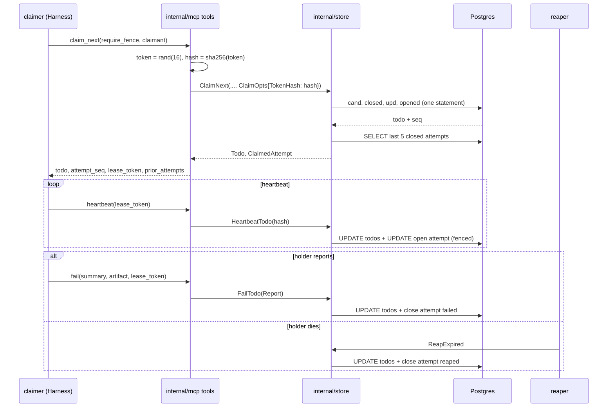
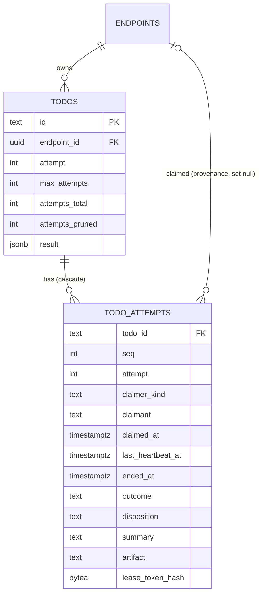

# Design: Attempt History on Todos

## Context

A todo's lifecycle ([SPEC-0003](../todo-queue/spec.md)) is implemented as single conditional
`UPDATE … RETURNING` statements in `internal/store/todos.go`: `ClaimTodo` and `ClaimNext` (with a
`cand` CTE that locks the row and carries `prior_state` for the lease-takeover counter),
`HeartbeatTodo`, `CompleteTodo`, `FailTodo`, `ReleaseTodo`, the `…OperatorOwned` Board variants,
`ReapExpired`, `RequeueDueRetries`, `RetryTodo`, the A2A transitions in `todos_a2a.go`, and
`deadLetterEndpointTodos`. None of them records who held a lease or how it ended. `todos.result` is
overwritten on every report and cleared by a manual retry.

[ADR-0039](../../../adrs/ADR-0039-attempt-history-on-todos.md) adds a per-attempt record, a
lease-token fence, `summary`/`artifact` inputs, attempts on claim responses, `get_todo` and
`release`. Governing spec: SPEC-0034.

Related specs: SPEC-0003 (lifecycle), SPEC-0004 (migrations, retention), SPEC-0006 (drain verbs),
SPEC-0013 (todo drawer), SPEC-0023 (metrics). In flight, by number: SPEC-0033 (teams), SPEC-0029
(notification sinks), SPEC-0024 (notify hooks), SPEC-0030 (admission), and Harness SPEC-0019 (the
first consumer).

## Goals / Non-Goals

### Goals

- One attempt row per committed claim, closed atomically by the transition that ends the lease.
- Died (lease lapsed) distinguishable from failed (holder reported).
- Attempts on claim responses, so relay consumers need no second call.
- An opt-in fence that gives an attempt an identity its holder alone can present.
- Bounded storage that ages out with the todo.
- No new tenant surface: attempts inherit the todo's owner scope.

### Non-Goals

- Changing `owner` to a per-session identity. Issue #160 stays open for that. The fence covers the
  stale-worker case for clients that opt in.
- A general audit log of every transition.
- Scanning summaries for secrets. Producers redact, and the docs say summaries are replayed to later
  claimers.
- Sending notifications. SPEC-0029 renders the REQ-15 payload.
- Per-queue or per-rule `max_attempts`. That remains a question for SPEC-0030 (admission control).

## Decisions

### A table keyed by `(todo_id, seq)`, with no scope column

**Choice**: `todo_attempts(todo_id, seq)` is the primary key, with an FK to `todos(id) ON DELETE
CASCADE`. There is no `endpoint_id` or `team_id` on the row.

**Rationale**: every read of an attempt starts from a todo id (a claim response, `get_todo`, the
drawer), so scoping by joining `todos` costs one primary-key lookup. Leaving the scope off the row
means SPEC-0033 can change what a todo's owner scope is (endpoint XOR team) without migrating
attempts, and makes it impossible for an attempt's scope to disagree with its todo's.

**Alternatives considered**:
- *Denormalize `endpoint_id` for scoped indexes*: rejected. No query lists attempts across todos,
  and a second copy of the tenant key is a second thing to get wrong once team-owned queues exist.

### Open and close inside the existing statements

**Choice**: extend each lifecycle statement with data-modifying CTEs rather than wrapping it in
application transactions. For example, `ClaimNext`:

```sql
WITH cand AS (
    SELECT id AS cand_id, state AS prior_state FROM todos
    WHERE endpoint_id=$4 AND queue = ANY($3) AND (assignee IS NULL OR assignee=$1)
      AND (state='pending'
           OR (state='claimed' AND lease_expires_at < now() AND attempt < max_attempts)
           OR (state='failed' AND next_retry_at IS NOT NULL AND next_retry_at <= now()
               AND attempt < max_attempts))
    ORDER BY created_at
    FOR UPDATE SKIP LOCKED
    LIMIT 1
),
closed AS (          -- a takeover closes the dead attempt first
    UPDATE todo_attempts a SET ended_at = now(), outcome = 'lease_expired',
           disposition = 'requeued'
    FROM cand
    WHERE a.todo_id = cand.cand_id AND a.ended_at IS NULL AND cand.prior_state = 'claimed'
    RETURNING a.todo_id
),
upd AS (
    UPDATE todos SET state='claimed', owner=$1, lease_expires_at=now()+$2::interval,
           attempt=attempt+1, attempts_total=attempts_total+1, claimed_at=now(),
           next_retry_at=NULL, updated_at=now()
    FROM cand WHERE todos.id = cand.cand_id
    RETURNING todos.*, cand.prior_state
),
opened AS (
    INSERT INTO todo_attempts (todo_id, seq, attempt, claimer_kind, claimer_endpoint_id,
                               claimer_session, owner, claimant, claimed_at, lease_expires_at,
                               lease_token_hash)
    SELECT upd.id, upd.attempts_total, upd.attempt, 'endpoint', $4, $5, $1, $6, now(),
           upd.lease_expires_at, $7
    FROM upd
    RETURNING seq
)
SELECT upd.…, upd.prior_state = 'claimed', (SELECT seq FROM opened) FROM upd;
```

`seq` is `todos.attempts_total` after the increment, so it needs no sequence object and no
`max(seq)` scan. It is never reset, because `RetryTodo` resets `attempt` but not `attempts_total`.

Postgres runs every data-modifying CTE against the same snapshot and applies all or none of them,
so the close, the update and the open commit together. The order in which the sub-statements run is
unspecified, which is why the one-open-attempt rule is a deferred exclusion constraint checked at
commit rather than a unique index checked per row (see *Schema*). The `closed` CTE's predicate
depends only on `cand`, never on `upd`'s output, so nothing else depends on the order either.

**Rationale**: the statements already hold the row lock and already carry `prior_state`. Adding arms
keeps one round trip per transition, and keeps the existing concurrency argument intact: whichever
of the reaper or a taker locks the row first changes it, and the other's predicate no longer
matches, so exactly one closes the attempt.

**Alternatives considered**:
- *Explicit `BEGIN … COMMIT` around two statements*: equally correct, and it adds a round trip on
  the hottest path. It is kept as the fallback where a CTE would be unreadable (the reaper's
  multi-row case uses a single `UPDATE … RETURNING` feeding an `UPDATE todo_attempts … FROM`).

### Closing in the reaper and sweeps

`ReapExpired` becomes:

```sql
WITH reaped AS (
    UPDATE todos SET
        state = CASE WHEN attempt >= max_attempts THEN 'failed' ELSE 'pending' END,
        owner = NULL, lease_expires_at = NULL, updated_at = now()
    WHERE state='claimed' AND lease_expires_at < now()
    RETURNING todos.*
),
closed AS (
    UPDATE todo_attempts a SET ended_at = now(), outcome = 'reaped',
        disposition = CASE WHEN r.state = 'failed' THEN 'dead_lettered' ELSE 'requeued' END
    FROM reaped r
    WHERE a.todo_id = r.id AND a.ended_at IS NULL
)
SELECT … FROM reaped;
```

`deadLetterEndpointTodos` gains the same `closed` arm with `outcome = 'revoked'`, and `CancelTodo`
with `outcome = 'canceled'`. `RequeueDueRetries` and `RetryTodo` touch no attempt, because they end
no lease. `RequeueDueRetries` does gain one side effect outside the store: each re-queued id is
cleared from the server's doorbell gate (`internal/server/listen.go`), so the `todo_ready` nudge
that follows rings it even inside the gate's one-minute window (SPEC-0034 REQ-16).

### The fence is a hash on the open attempt

**Choice**: when `require_fence` is set, the MCP layer generates 16 random bytes, encodes them as a
base64url token, and passes the SHA-256 to the store. The fenced statements add:

```sql
AND EXISTS (SELECT 1 FROM todo_attempts a
            WHERE a.todo_id = todos.id AND a.ended_at IS NULL
              AND (a.lease_token_hash IS NULL AND $token_hash IS NULL
                   OR a.lease_token_hash = $token_hash))
```

The comparison runs in SQL on fixed-length digests, so a timing difference reveals nothing about the
token. A mismatch makes the `UPDATE` affect no rows, `classifyMiss` sees the row exists, and the
result is `conflict`. That is the same error as "not the owner", so the fence's existence is not an
oracle.

The Board's `…OperatorOwned` paths omit the predicate. The owning human can always recover a stuck
attempt.

**Rationale**: a random token beats `seq` as the fence because `seq` is readable through
`get_todo`, so an agent holding the endpoint could present it. Storing only the hash means a
database read does not hand out live capabilities.

### Summaries are truncated, never rejected

**Choice**: `summary` is cut to 2048 bytes at the last complete UTF-8 rune, `claimant` to 128 bytes
with control characters stripped. `artifact` is validated and rejected with `invalid` when
malformed, because a malformed handle is a bug the caller should see, while a long summary is just
long.

**Rationale**: a reporter's verdict must never be lost because its prose ran long.

### No summary from `result` unless the operator opts in

**Choice**: a close without `summary` stores a null summary. `SWITCHBOARD_ATTEMPT_SUMMARY_FROM_RESULT`
(default `false`) makes the store derive it from the compact JSON of `result`, truncated like any
summary.

**Rationale**: no read returns `result` today (`todoOut` in `internal/mcp/tools.go` omits it). Deriving summaries from it would start
showing existing clients' results to later claimers and to notification sinks without their knowing.
An operator whose clients write safe results can turn it on; the default stays closed (Joe, 2026-09-22:
risky options are fine when configurable and off by default).

### `get_todo` is implied by `list_todos`

**Choice**: `registerTools` registers `get_todo` when the scope holds `list_todos` or `get_todo`, and
the scope guard allows it on the same condition. `DrainVerbs()` lists `get_todo` and `release`, so
the vend wizard and the consent screen offer them for new endpoints.

**Rationale**: existing endpoints cannot gain verbs without re-vending (issue #163). `get_todo`
reads only rows the endpoint can already enumerate, plus attempt text written through its own
credential, so it confers no new power. `release` changes state, so it is never implied.

### Retention needs no new sweep

**Choice**: cascade delete, plus a per-todo cap enforced when an attempt opens:

```sql
DELETE FROM todo_attempts
WHERE todo_id = $1 AND ended_at IS NOT NULL
  AND seq <= (SELECT attempts_total FROM todos WHERE id = $1) - $cap
```

This runs in the claim transaction only when `attempts_total > cap`, which is rare, and it increments
`todos.attempts_pruned` by the number of rows deleted.

**Rationale**: the existing hybrid retention already deletes terminal todos, and a live todo's
history is exactly the part worth keeping.

## Architecture

### Schema

```sql
CREATE TABLE todo_attempts (
    todo_id             text        NOT NULL REFERENCES todos(id) ON DELETE CASCADE,
    seq                 int         NOT NULL,
    attempt             int         NOT NULL,
    claimer_kind        text        NOT NULL CHECK (claimer_kind IN ('endpoint','owner')),
    claimer_endpoint_id uuid        REFERENCES endpoints(id) ON DELETE SET NULL,
    claimer_session     text,
    owner               text        NOT NULL,
    claimant            text        CHECK (octet_length(claimant) <= 128),
    claimed_at          timestamptz NOT NULL DEFAULT now(),
    last_heartbeat_at   timestamptz,
    lease_expires_at    timestamptz NOT NULL,
    ended_at            timestamptz,
    outcome             text CHECK (outcome IN ('completed','failed','released','lease_expired',
                                                'reaped','canceled','revoked')),
    disposition         text CHECK (disposition IN ('done','retry_scheduled','requeued',
                                                    'dead_lettered','canceled')),
    summary             text        CHECK (octet_length(summary) <= 2048),
    summary_truncated   boolean     NOT NULL DEFAULT false,
    artifact            text        CHECK (octet_length(artifact) <= 512),
    lease_token_hash    bytea       CHECK (octet_length(lease_token_hash) = 32),
    PRIMARY KEY (todo_id, seq),
    CHECK ((ended_at IS NULL) = (outcome IS NULL)),
    CHECK ((ended_at IS NULL) = (disposition IS NULL))
);

-- At most one open attempt per todo (SPEC-0034 REQ-2), checked at COMMIT. A plain unique partial
-- index would be checked row by row, and the order in which a statement's data-modifying CTEs run
-- is unspecified, so a takeover's INSERT of the new attempt could be checked before its UPDATE
-- closing the old one. A deferred exclusion constraint sees only the committed result.
ALTER TABLE todo_attempts ADD CONSTRAINT todo_attempts_one_open
    EXCLUDE USING btree (todo_id WITH =) WHERE (ended_at IS NULL)
    DEFERRABLE INITIALLY DEFERRED;

ALTER TABLE todos ADD COLUMN attempts_total  int NOT NULL DEFAULT 0;
ALTER TABLE todos ADD COLUMN attempts_pruned int NOT NULL DEFAULT 0;

-- Backfill: one open attempt per in-flight lease (SPEC-0034 REQ-17).
UPDATE todos SET attempts_total = 1 WHERE state IN ('claimed','input-required','auth-required');
INSERT INTO todo_attempts (todo_id, seq, attempt, claimer_kind, owner, claimant, claimed_at,
                           lease_expires_at)
SELECT id, 1, attempt, 'endpoint', COALESCE(owner, ''), 'migrated', COALESCE(claimed_at, now()),
       COALESCE(lease_expires_at, now())
FROM todos WHERE state IN ('claimed','input-required','auth-required');
```

The migration takes the next free number in `internal/db/migrations/` when it is written; several
in-flight specs add migrations, so the number is not reserved here.

`claimer_endpoint_id` is `ON DELETE SET NULL` because an endpoint row can outlive or predate its
todos in odd ways. The todo's own FK is what governs the attempt's lifetime.

### Store API

```go
// internal/store
type Attempt struct {
    Seq              int
    Attempt          int
    ClaimerKind      string // endpoint | owner
    ClaimantLabel    string
    ClaimedAt        time.Time
    LastHeartbeatAt  *time.Time
    LeaseExpiresAt   time.Time
    EndedAt          *time.Time
    Outcome          string // "" while open
    Disposition      string
    Died             bool   // derived: outcome in (lease_expired, reaped)
    Summary          string
    SummaryTruncated bool
    Artifact         string
}

type ClaimOpts struct {
    TTL       time.Duration
    Claimant  string
    Session   string // MCP session id, "" when not over MCP
    TokenHash []byte // nil when require_fence is false
}

type Report struct {
    Result    []byte
    Summary   string
    Artifact  string
    TokenHash []byte // nil when the caller sent no lease_token
}

func (s *Store) ClaimNext(ctx context.Context, endpointID string, queues []string, owner string,
    o ClaimOpts) (Todo, ClaimedAttempt, error)
func (s *Store) CompleteTodo(ctx context.Context, endpointID, id, owner string, r Report) (Todo, error)
func (s *Store) FailTodo(ctx context.Context, endpointID, id, owner string, r Report) (Todo, error)
func (s *Store) ReleaseTodo(ctx context.Context, endpointID, id, owner string, r Report) (Todo, error)
func (s *Store) HeartbeatTodo(ctx context.Context, endpointID, id, owner string, ttl time.Duration,
    tokenHash []byte) (Todo, error)
func (s *Store) TodoAttempts(ctx context.Context, endpointID, id string, limit int) ([]Attempt, int, int, error)
```

`ClaimedAttempt` carries `Seq` and the five most recent closed `Attempt`s, read in the same call
after the claim commits. `TodoAttempts` is scoped by `endpoint_id` in its `WHERE` clause and returns
`ErrNotFound` for a foreign or unknown id. The `…OperatorOwned` variants take `ownerHumanID` and use
`operatorOwns`, exactly as today.

### MCP shapes

```jsonc
// claim_next input (new fields optional)
{"queue": "ci-failures", "lease_ttl_seconds": 300,
 "require_fence": true, "claimant": "harness/buildbox/ci-fixer/run-43"}

// claim_next output
{"empty": false,
 "todo": {"id": "td_8f2c", "queue": "ci-failures", "state": "claimed", "attempt": 3,
          "max_attempts": 5, "…": "…"},
 "attempt_seq": 7,
 "lease_token": "q3v…Zw",                 // only when require_fence
 "attempts_total": 7,
 "prior_attempts": [
   {"seq": 6, "attempt": 2, "claimer_kind": "endpoint",
    "claimant": "harness/buildbox/ci-fixer/run-41",
    "claimed_at": "…", "last_heartbeat_at": "…", "ended_at": "…",
    "outcome": "failed", "disposition": "retry_scheduled", "died": false,
    "summary": "attempt 2/5 · …", "summary_truncated": false, "artifact": "mcp://cairn/Ab12Cd34"}
 ]}

// fail input
{"id": "td_8f2c", "result": {"harness": {"…": "…"}}, "summary": "…",
 "artifact": "mcp://cairn/Ab12Cd34", "lease_token": "q3v…Zw"}

// fail output: todoOut plus
{"next_retry_at": "2026-09-22T15:32:00Z", "dead_letter": false}

// get_todo input / output
{"id": "td_8f2c", "attempts_limit": 20}
{"todo": {"…": "…", "result": {"…": "…"}, "next_retry_at": null, "dead_letter": true},
 "attempts": [ /* newest first, open attempt included */ ],
 "attempts_total": 5, "attempts_pruned": 0}
```

### Flow



### Entity relationship



### Where the pieces live

| File | Change |
| --- | --- |
| `internal/db/migrations/00NN_todo_attempts.sql` | New table, indexes, `todos` columns, backfill |
| `internal/store/todos.go` | CTE arms on claim, heartbeat, complete, fail, release, reap, revoke; `TodoAttempts` |
| `internal/store/todos_a2a.go` | `CancelTodo` closes the attempt |
| `internal/store/retention.go` | No change; cascade covers it (a test proves it) |
| `internal/mcp/tools.go` | New arguments, response fields, `get_todo`, `release`, token generation |
| `internal/mcp/verbs.go` | `DrainVerbs()` gains `get_todo`, `release` |
| `internal/web/todos.go`, templates | Attempt list in the drawer |
| `internal/mcp/a2ui.go` | Attempt list in the todo detail resource |
| `internal/metrics` | `switchboard_todo_attempts_closed_total` |

## Risks / Trade-offs

- **Write amplification on heartbeat** → one extra single-row update by primary key per heartbeat.
  REQ-18's 10% budget is the tripwire. If it trips, `last_heartbeat_at` moves to a sampled write
  (only when it would change by more than a minute), which keeps REQ-4's bound on time of death
  within a minute.
- **Summaries as an injection channel** → labelled as data in schemas and docs, bounded, and never
  interpreted by Switchboard. The consumer's prompt still has to treat them as data. Harness writes
  them to a file, never to argv or a prompt.
- **Fence misuse** → a client that claims with `require_fence` and then loses its token (a crash)
  cannot heartbeat or report. That is intended: the lease lapses, the attempt is recorded `reaped`,
  and the owning human can still act from the Board.
- **CTE complexity** → each lifecycle statement grows. Every arm gets a store test, and the existing
  concurrency tests are re-run with attempt assertions (one open attempt at most, and each close
  exactly once).
- **A deferred constraint fails late** → a bug that opens a second attempt surfaces as a failed
  COMMIT, not a failed INSERT. The store maps that error to an internal error with the todo id, and a
  test plants the violation to prove the constraint fires.
- **Migration on a large `todos` table** → `ADD COLUMN … DEFAULT 0` is metadata-only on supported
  Postgres. The backfill touches only in-flight rows.

## Migration Plan

1. Ship the migration and store changes, with attempts written but only exposed by `get_todo`.
2. Ship the MCP arguments and response fields, which are additive and optional.
3. Ship the Board drawer and the metric.
4. Harness SPEC-0019 detects the new schema fields and starts using the fence and summaries.

Rollback: the new columns and table are ignored by older binaries. Dropping them is a follow-up
migration, and it loses only history.

## Open Questions

- Should `list_todos` rows carry `next_retry_at` and `dead_letter` too? Issue #214 asks for it, and
  it is cheap. It is tracked there, not here.
- Should the per-todo cap keep the *first* attempt as well as the newest ones? It helps when the
  first failure explains everything; it costs a slightly odd pruning rule.
- Should a human's Board claim be allowed to request a fence? Not needed today.
