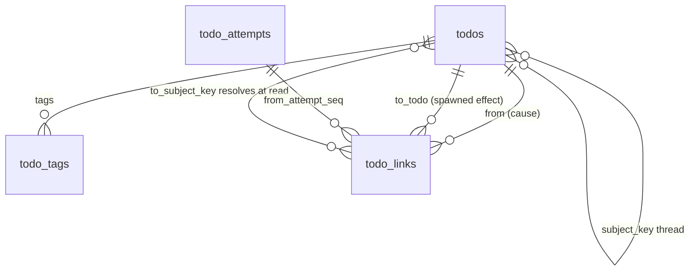

# Design: Todo Lineage, Subject Threads and Tags

## Context

A self-hosting user built a relationship graph over `/todos` and filed the gaps they hit:
stump-wtf/switchboard#28 (no todo-to-todo causality) and stump-wtf/cairn#3 (no
artifact-to-artifact relation). Their graph:

* groups todos by origin (`repo#57`, `repo@master`);
* shows claimants;
* can draw "A produced B" only as a guess, by matching `todo_attempts.artifact` against
  `work_order.subject`.

`routing.Subject` (`internal/routing/subject.go`) covers only forge issues and Cairn artifacts,
because it exists for work orders (ADR-0025). Grouping every todo needs a broader, separate
projection.

## Goals / Non-Goals

### Goals

* A thread key on every event-minted todo, covering forge issues, PRs, comments, reviews, branches,
  workflow runs, releases, and Cairn artifacts.
* Causal links that are recorded, never inferred. Each carries provenance and an actor.
* One normalizer for every reference shape.
* Tags from rules, agents, humans and producers, filterable everywhere.
* The `/graph` view, and lineage on the todo page.

### Non-Goals

* Links across owner scopes, including A2A delegation from a friend. Those are shown as "delegated
  by persona", not linked.
* Inferred or fuzzy links.
* Slack, Linear and Plain thread keys. The projection is table-driven, so each can be added as its
  own small story.
* Graph layout algorithms beyond grouped columns. The grid is the layout.

## Decisions

### `ThreadKeyOf` is a new function beside `SubjectOf`

`SubjectOf` returns nil for pull requests on purpose: the lane router must not mint work orders from
PR events. Widening it would change routing, so `ThreadKeyOf` is separate. It lives in
`internal/routing/thread.go`, is table-driven over `(provider, event) → extractor`, and has one test
per row. The event name comes from `X-Gitea-Event` / `X-GitHub-Event`, as `issueSubject` reads it
today. For the `generic` source, the same header sniffing applies.

The extractors unmarshal a minimal struct per event family:

* `number`, `issue.number` or `pull_request.number` give the `#` form;
* `ref`, `workflow_run.head_branch`, `check_suite.head_branch` or `release.tag_name` give the `@`
  form.

### Where the key is written

`CreateTodoParams` gains `SubjectKey string`. Every mint path already calls `SubjectOf` or has the
headers and body at hand:

* `internal/ingest/selfmanaged.go` (routed and intake paths);
* the dev helper.

Each sets `SubjectKey: routing.ThreadKeyOf(...)`. `CreateTodo`'s INSERT adds the column. Because
`CreateEventTodos` mints one todo per target endpoint, every copy gets the same key, and each lives
in its own endpoint's scope.

### `todo_links` stores keys for `produced` and ids for `spawned`

```sql
ALTER TABLE todos ADD COLUMN subject_key text CHECK (octet_length(subject_key) <= 256);
CREATE INDEX idx_todos_subject_key ON todos (subject_key, created_at) WHERE subject_key IS NOT NULL;

CREATE TABLE todo_links (
    id                bigint GENERATED ALWAYS AS IDENTITY PRIMARY KEY,
    from_todo_id      text        NOT NULL REFERENCES todos(id) ON DELETE CASCADE,
    from_attempt_seq  int,
    kind              text        NOT NULL CHECK (kind IN ('produced','spawned')),
    to_subject_key    text        CHECK (octet_length(to_subject_key) <= 256),
    to_todo_id        text        REFERENCES todos(id) ON DELETE CASCADE,
    provenance        text        NOT NULL CHECK (provenance IN ('declared','api','tagged','trace')),
    actor_ref         text        NOT NULL CHECK (octet_length(actor_ref) <= 128),
    created_at        timestamptz NOT NULL DEFAULT now(),
    CHECK ((kind = 'produced') = (to_subject_key IS NOT NULL)),
    CHECK ((kind = 'spawned')  = (to_todo_id IS NOT NULL))
);
CREATE UNIQUE INDEX uq_todo_links_stmt ON todo_links
    (from_todo_id, kind, COALESCE(to_subject_key, to_todo_id), provenance);
CREATE INDEX idx_todo_links_to_key  ON todo_links (to_subject_key) WHERE to_subject_key IS NOT NULL;
CREATE INDEX idx_todo_links_to_todo ON todo_links (to_todo_id)     WHERE to_todo_id IS NOT NULL;

CREATE TABLE todo_tags (
    todo_id   text        NOT NULL REFERENCES todos(id) ON DELETE CASCADE,
    tag       text        NOT NULL CHECK (tag ~ '^[a-z0-9._:/#-]{1,64}$'),
    origin    text        NOT NULL CHECK (origin IN ('rule','agent','human','producer')),
    added_by  text        NOT NULL CHECK (octet_length(added_by) <= 128),
    added_at  timestamptz NOT NULL DEFAULT now(),
    PRIMARY KEY (todo_id, tag)
);
CREATE INDEX idx_todo_tags_tag ON todo_tags (tag);
```

Inserts use `ON CONFLICT DO NOTHING`, so a statement is idempotent and a tag's first origin wins.
Caps are enforced with a count guard in the same statement:

```sql
INSERT … SELECT … WHERE (SELECT count(*) FROM todo_tags WHERE todo_id = $1) < 32
```

The row lock the transition already holds serializes these.

### Resolution queries are scoped once, by `scopeJoin`

The web path's lineage reads:

```sql
-- producers of todo T (key K, owner human $h)
SELECT l.from_todo_id, l.from_attempt_seq, l.provenance, l.actor_ref
FROM todo_links l
JOIN todo_attempts a ON a.todo_id = l.from_todo_id AND a.seq = l.from_attempt_seq
JOIN todos f ON f.id = l.from_todo_id <ownedByHuman(f, $h)>
WHERE l.kind = 'produced' AND l.to_subject_key = $K
  AND $T_created_at >= a.claimed_at - interval '60 seconds' AND l.from_todo_id <> $T;
```

The downstream query is the mirror image: `todos t <ownedByHuman(t,$h)> WHERE t.subject_key =
l.to_subject_key AND t.created_at >= a.claimed_at - 60s`. The ownership join is written once, as
`scopeJoin(alias)`, for the human and endpoint variants. ADR-0038 then widens it in one place. Both
sides of every link are filtered, so a link can never name a todo outside the scope.

### Link writes

| Statement | Where | Transaction |
| --- | --- | --- |
| `produced` (MCP) | `CompleteTodoWith`, `FailTodoWith`, `ReleaseTodoWith`, `HeartbeatTodoWith` | A CTE arm in the same statement. `Report` gains `Produced []string` (pre-normalized keys) |
| artifact → `produced` | The same statements | Normalized in Go before the call, and appended to `Produced` |
| `produced` (span) | SPEC-0036 span store | The same transaction as the span upsert |
| `spawned` (`api`) | `CreateTodo` with `CausedBy` | The INSERT … SELECT only when `caused_by` passes `scopeJoin` |
| `spawned` (`tagged`, `trace`) | `CreateEventTodos` | After each todo insert, in the same tx. Scope is the minted todo's endpoint's human |

Normalization and grammar checks happen in Go, in the MCP and API layers, before the store call.
The store receives only valid keys and tags, and its CHECK constraints are a backstop.

### The graph is HTML first, with an SVG overlay

`internal/web/graph.go`:

* **`GraphQuery`** returns the todos in view, together with their tags, their claimant (the last
  attempt's endpoint name) and their outgoing links, already resolved per REQ-7 against the same
  view set. An edge is drawn only when both ends are in view. Otherwise it is listed as text only.
* **`BuildGraph`** is pure. It groups by key, orders the groups by their latest `created_at`, and
  assigns each endpoint a palette index from the FNV hash of its id, modulo 8.

The template renders:

```html
<section class="sb-graph-group" aria-labelledby="g-3"><h2 id="g-3">abrahms/sublayer#57 <small>gitea</small></h2>
  <ol>
    <li class="sb-graph-card" id="n-td_cb6d" data-sb-node="td_cb6d">
      <a href="/todos/td_cb6d">td_cb6d</a> PR #57 opened … <span class="sb-chip sb-claimant-3">ci-fixer</span>
      <ul class="sb-graph-links">
        <li data-sb-edge-from="td_cb6d" data-sb-edge-to="td_1dcf" data-sb-edge-kind="produced"
            data-sb-edge-provenance="declared">produced abrahms/deaddrop#17 (declared by ci-fixer)</li>
      </ul>
    </li>
  </ol>
</section>
```

`static/js/sb-graph.js` is about 120 lines of vanilla JS:

1. On `DOMContentLoaded` and `htmx:afterSwap`, it collects the `[data-sb-edge-from]` elements.
2. For each pair of nodes in view, it computes the card rectangles relative to the graph container.
3. It emits a cubic Bézier `<path>` in a single absolutely-positioned `<svg aria-hidden="true">`,
   with markers for the arrowheads.
4. A `ResizeObserver` triggers a redraw.

Provenance maps to a CSS class (`sb-edge-declared` and so on) whose stroke dash comes from tokens.
There is no inline script and no `eval`, so it runs under the existing CSP.

### Tags on MCP verbs

The input structs in `internal/mcp/tools.go` gain `Tags []string` and `Produced []string`, and the
outputs gain `SubjectKey`, `Tags`, `ProducedIgnored` and `TagsIgnored`. `get_todo` gains `Lineage`.
`list_todos` gains `tag` and `subject_key` filters, each an `EXISTS` or equality clause.

### Cairn

Cairn already puts `tags` in `artifact.created`, which `cairnSubject` reads. The `todo:` and
`trace:` tag conventions therefore work today. When Cairn ships the companion change (a relation and
`trace_id`), `cairnSubject` reads two more fields:

* `data.trace_id` becomes a `trace` link (REQ-10);
* `data.in_reply_to` / `data.derived_from`, an artifact id, becomes a `spawned` link from the todo
  whose thread key is `cairn:<that id>` in scope. That is the most recent such todo, with provenance
  `tagged`.

The second path is described here so both sides agree. Its story waits on Cairn.

## Architecture

### Where the pieces live

| Piece | Location |
| --- | --- |
| Thread keys, normalizer | `internal/routing/thread.go`, `internal/routing/normalize.go` |
| Tag grammar | `internal/routing/tags.go`, shared with rule validation |
| Migration | `internal/db/migrations/00NN_todo_lineage.sql` |
| Store | `internal/store/{links,tags,lineage}.go`; `CreateTodoParams.SubjectKey`, `.Tags`, `.CausedBy`; `Report.Produced`, `.Tags` |
| Rule action tags | `internal/routing/routing.go` `Action.Tags` |
| MCP args and fields | `internal/mcp/tools.go`, `get_todo.go` |
| Operator API | `internal/server/api.go` `PushTodo` |
| Pages | `internal/web/{graph,lineage}.go`, `templates/graph.html`, `templates/fragments/lineage.html`, `static/js/sb-graph.js` |
| Backfill | `cmd/switchboard` `backfill-threads` |
| Config | `SWITCHBOARD_FORGE_HOSTS`, `SWITCHBOARD_CAIRN_ORIGIN` in `internal/config` |

### Entity relationship



## Risks / Trade-offs

* **Read-time resolution cost.** Lineage and graph queries join links to todos by key. The indexes
  on `todos(subject_key, created_at)` and `todo_links(to_subject_key)` keep this to index probes.
  The graph bounds the set to 300 todos first, then resolves edges within that set only.
* **Over-declaration.** An agent can declare anything it can normalize. The edge is labelled with the
  endpoint and scoped to the human who owns that agent, so a misbehaving agent can only mislead its
  own owner, and visibly so.
* **Thread-key drift.** A forge renames a repo, and the key changes mid-thread. This is accepted: the
  UI shows two threads, and a human can tag them together. Keys are identity at the time of
  delivery, not a registry.
* **`todo:` tags from producers.** Anyone who can make a verified delivery on the webhook can link a
  new todo to any todo in the same owner scope. With trusted actors configured (SPEC-0026), only
  trusted actors can. Provenance `tagged` is dashed and labelled for this reason.

## Migration Plan

1. One additive migration: the `todos.subject_key` column, the `todo_links` and `todo_tags` tables,
   and the indexes. Nothing is backfilled at migrate time.
2. Mint paths start writing keys. The `backfill-threads` subcommand fills history on demand.
3. MCP arguments and fields are additive. Old clients see no change.

## Open Questions

* Should forge labels be copyable as tags per webhook (opt-in, origin `producer`)? This is deferred.
  Labels keep their routing meaning, and a rule's `tags` action can already express "this label
  means this tag".
* Should the graph offer a "thread timeline" mode (swimlanes by thread on a time axis) as well as
  the grid? Revisit after the grid is in use.
