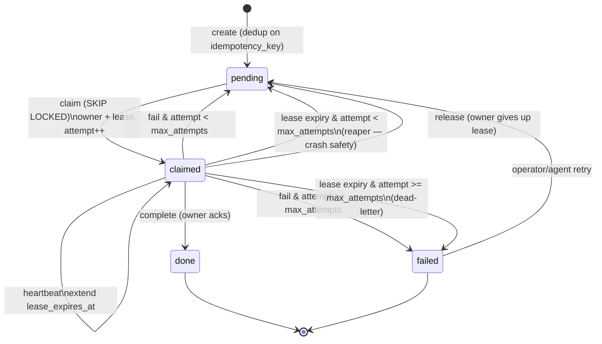

# Design: Todo Work-Queue

## Context

The foundation of switchboard is an event store — receive, verify, persist, expose. That layer
answers "what happened?" but not "what still needs doing, by whom, and did it get done?" An agent
reading an event stream has no durable notion of ownership, completion, or retry: if it crashes
mid-work the event has already been read and nothing re-surfaces it.

This capability (SPEC-0003) defines the primitive that fixes that: the **todo**, a durable work-item
with a lifecycle, an owner, an idempotency key, and lease/ack semantics. It realizes
[ADR-0007](../../../adrs/ADR-0007-todos-as-core-primitive.md). The primitive has to be correct under
three simultaneous facts: inbound webhooks are at-least-once and duplicate-prone; agents are
unreliable workers that crash, restart, and run concurrently; and MCP has no server→client push, so
the primitive must be *pullable* — an agent drains its own list on its own loop.

The queue is persisted in PostgreSQL and every mechanic below is a database transition, so this
capability requires [SPEC-0004 (persistence)](../persistence/spec.md). The reference implementation
is `internal/store/todos.go` over the `todos` table in `internal/db/migrations/0001_init.sql`.

## Goals / Non-Goals

### Goals

- A durable work-item with a four-state lifecycle (`pending → claimed → done | failed`) that survives
  worker crashes.
- Atomic, single-owner claims that scale with worker count (`FOR UPDATE SKIP LOCKED`).
- SQS-exact visibility windows: claim = receive, heartbeat = change-visibility, complete = delete,
  lease expiry = reappear.
- Idempotent enqueue that collapses at-least-once duplicate deliveries into one work-item.
- Bounded retries with dead-lettering at `max_attempts`.
- Crash safety via a lease reaper that requeues (or dead-letters) expired leases.

### Non-Goals

- The MCP verb surface (`list_todos`, `claim`, `complete`, `fail`, `create_for`) that drives these
  transitions — that is the agent-mcp-tools capability; this spec is the state machine underneath it.
- Push delivery — Channels (ADR-0013) adds a best-effort notify layer on top of this durable pull
  queue; it never replaces claiming from the queue.
- Persistence mechanics (pool, migrations, indexes, retention) — those are SPEC-0004.
- Exactly-once processing — not achievable end-to-end; the queue is at-least-once and handlers stay
  idempotent.
- Routing rules / idempotency-key derivation from raw deliveries — owned by ingestion-adapters.

## Decisions

### Durable todo/work-item over message-inbox or push

**Choice**: The core object is a durable todo with an explicit lifecycle, claimed under a lease and
completed with an ack, deduplicated by idempotency key.
**Rationale**: Only this option is simultaneously crash-safe (a lapsed lease re-surfaces the work),
dedup-correct (at-least-once deliveries collapse by key), concurrency-safe (the lease guarantees
single-ownership), and compatible with MCP's pull-only reality (no delivery infra to build or fail).
**Alternatives considered**:
- Message/inbox (read-once or read-with-offset): read-once loses work on a crash between read and
  completion; no native dedup; no lease, so concurrent consumers double-process. Rejected.
- Push/event-driven: MCP cannot push over the primary agent interface, and push shifts
  delivery-reliability and retry burden onto switchboard. Rejected.

### Claim as an SQS visibility timeout

**Choice**: `claim` sets `owner` + `lease_expires_at = now + ttl`, making the todo invisible for the
window; `heartbeat` extends it; lease expiry pops it back to `pending`.
**Rationale**: The SQS visibility-timeout model is the proven pattern for a durable queue with
unreliable consumers, and it maps one-to-one onto the operations agents need.
**Alternatives considered**:
- A hard row lock held for the duration of work: ties queue liveness to a live connection and does
  not survive a crashed worker cleanly. Rejected.

### FOR UPDATE SKIP LOCKED for concurrent claims

**Choice**: Select the next pending row with `FOR UPDATE SKIP LOCKED` ordered by `created_at`, then
update it to `claimed` and return it.
**Rationale**: The canonical Postgres durable-queue primitive — concurrent claimants each grab a
different row with no thundering herd; the queue scales with worker count, not against it.
**Alternatives considered**:
- A single global claim lock: serializes every worker. Rejected.
- Advisory locks per todo: more moving parts than `SKIP LOCKED` and no better guarantee. Rejected.

### Idempotent enqueue via ON CONFLICT on a partial unique index

**Choice**: `INSERT … ON CONFLICT (queue, idempotency_key) WHERE idempotency_key IS NOT NULL AND
state <> 'done' AND state <> 'failed' DO NOTHING RETURNING *`; an empty return means the existing
non-terminal todo already covers the delivery, which is then fetched and returned.
**Rationale**: Makes create atomic and idempotent at the database, giving the store-then-ack path a
clean outcome and collapsing duplicate webhook deliveries into one todo.
**Alternatives considered**:
- Read-then-insert in the app: racy under concurrency. Rejected.

## Architecture

The state machine as implemented: `create` yields `pending`; an atomic claim moves it to `claimed`
under a lease; the owner completes (→`done`), fails (→`pending` retry or `failed` dead-letter), or
lets the lease lapse (reaper → `pending` or `failed`).

The `todos` columns backing this (from `0001_init.sql`): `id` (text, `td_<uuid>`), `queue`, `source`,
`kind`, `title`, `payload` (jsonb), `event_id` → `events(id)`, `idempotency_key`, `assignee`,
`state` (`pending|claimed|done|failed`, default `pending`), `owner`, `lease_expires_at`, `attempt`
(default 0), `max_attempts` (default 5), `result` (jsonb), `created_at`, `updated_at`, `claimed_at`,
`completed_at`. Two indexes carry the hot path: partial `idx_todos_pending (queue, created_at) WHERE
state='pending'` for the claim scan, and partial unique `idx_todos_dedupe (queue, idempotency_key)
WHERE idempotency_key IS NOT NULL AND state <> 'done' AND state <> 'failed'` for enqueue dedup.

The core transitions map directly to functions in `internal/store/todos.go`:

- `CreateTodo` — `INSERT … ON CONFLICT DO NOTHING`; on conflict returns the existing non-terminal
  todo and `created=false`.
- `ClaimNext(queues, owner, ttl)` — `FOR UPDATE SKIP LOCKED` pool claim across allowed queues.
- `ClaimTodo(id, owner, ttl)` — claim a specific pending todo, respecting `assignee`.
- `CompleteTodo(id, owner, result)` — `state='done'` guarded by `state='claimed' AND owner=$owner`.
- `FailTodo(id, owner, result)` — `CASE WHEN attempt >= max_attempts THEN 'failed' ELSE 'pending'`.
- `ReapExpired()` — requeue/dead-letter all `claimed` rows with `lease_expires_at < now()`.
- `classifyMiss` — turns a zero-row conditional update into `ErrConflict` (row exists) or
  `ErrNotFound` (row absent).

## Risks / Trade-offs

- **At-least-once means handlers must be idempotent** → documented as a hard handler requirement; a
  re-delivered todo (post-crash) must be safe to process again.
- **Leases add a time dimension (TTL tuning, clock assumptions)** → the cost of crash-safety; leases
  are compared against `now()` server-side so there is a single clock.
- **Polling latency** → mitigated by long-poll/backoff in the worker loop and, where supported, a
  Channels notify (ADR-0013) that wakes the consumer while the durable queue stays the ledger.
- **Reaper cadence vs. lease TTL** → if the reaper runs less often than leases expire, a lapsed todo
  waits for the next sweep; a claim scan may also observe it. Tune reaper interval below typical
  lease TTL.
- **A slow worker that misses its heartbeat** → its todo reappears and may be double-claimed; this is
  intended at-least-once behavior, kept correct by idempotent handlers.

## Migration Plan

Greenfield — the `todos` table and its indexes ship in `internal/db/migrations/0001_init.sql` and are
applied by the SPEC-0004 embedded migrator on first startup. No data migration.

## Open Questions

- **Event/todo seam** (ADR-0007 open question): whether the event read tools and the todo tools
  remain two surfaces indefinitely, or events become a pure sub-record of todos. Current schema keeps
  them distinct with `todos.event_id`.
- **`release` verb**: the todos contract and ADR describe a voluntary `release` (owner gives up the
  lease → `pending`) but the reviewed `internal/store/todos.go` does not yet expose a dedicated
  `Release` function — release currently rides on lease expiry or `fail`. Whether to add an explicit
  `ReleaseTodo` is left to confirm.
- **`heartbeat` implementation**: the contract specifies heartbeat (extend `lease_expires_at`, owner
  only) but no `HeartbeatTodo` function is present in the reviewed store package yet; the SQL is a
  guarded `UPDATE … SET lease_expires_at = now() + $ttl WHERE state='claimed' AND owner=$owner`. The
  contract is fixed here; the function is a follow-up.
- **Operator retry of dead-letters**: the `failed → pending` manual re-queue is specified but the
  attempt-budget reset policy on manual retry is not yet pinned down in code.
