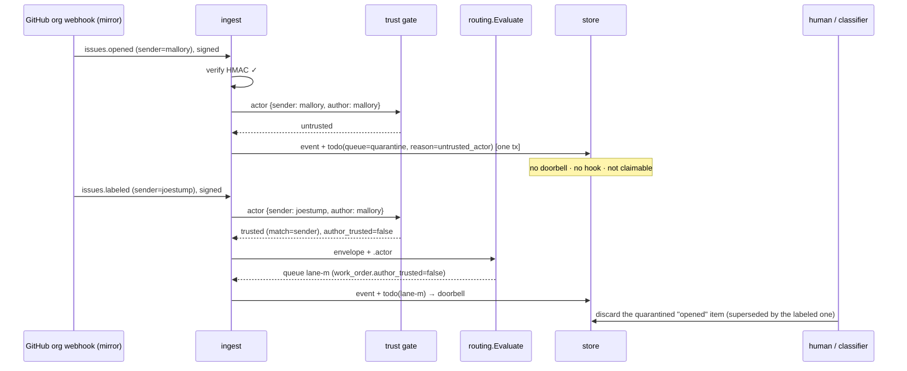

# Design: Fail-Closed Trusted-Actor Intake and Quarantine

## Context

Routing ([SPEC-0020](../event-routing/spec.md)) is first-match-wins, and a faulting rule is
treated as no-match (`internal/routing/routing.go`). `internal/ingest/selfmanaged.go` logs the
fault as a warning and routes anyway. A failed sandbox makes rules route by default
(`internal/ingest/ingest.go`). `set_webhook_rules` rebuilds `Params` from the request, so omitting
it clears allowlists (`internal/mcp/webhook_rules.go`). Trust exists only as jq over `.issue.author`
and `.artifact.actor_id`.

GitHub Issues are now open on the public mirrors as outside intake. The on-demand one-shot path
means a routed event can start an agent within seconds.
[ADR-0031](../../../adrs/ADR-0031-fail-closed-trusted-actor-intake-and-quarantine.md) decides:
fail closed, first-class `trusted_actors`, and a quarantine queue drained only by a human or a
tool-less classifier. Governing spec: SPEC-0026. Extended: SPEC-0020. Amended: the SPEC-0011
sender gate.

## Goals / Non-Goals

### Goals

- No rule fault, sandbox failure or omitted field can widen what reaches a work lane.
- One field states "who may start work here", for every event shape both forges and Cairn send.
- Untrusted input is kept, visible, and promotable, and never pushed to an agent with tools.
- Everything is owner-scoped. There is no instance-wide trust list and no instance-wide
  quarantine.

### Non-Goals

- Content-based classification inside Switchboard. The classifier is an external, tool-less
  endpoint.
- Trust for token-trust (`generic`) webhooks. Their bodies are unsigned.
- Numeric forge-id matching (a follow-up).
- Retroactively re-routing deliveries that were dropped before this ships.

## Decisions

### Fault = stop, as a property of `routing.Evaluate`

**Choice**: `Evaluate` returns `Decision{Disposition: Faulted, Fault: …}` as soon as a rule faults,
instead of appending to `Trace.Faults` and continuing. The receiver maps `Faulted` to
"persist the event and no todo" (the fail-closed story), and later to "quarantine" (quarantine story).
`test_webhook_rules` reports `faulted` as a blocking outcome.

**Rationale**: putting fail-closed in the pure evaluator means the live receiver, the dry-run and
the save-time check all inherit it, and cannot disagree. The fleet pack's hand-written `| arrays`
guards stay harmless and become belt-and-braces.

**Alternatives considered**:
- Fail closed only for `drop` rules and rules followed by a `queue` (option 1 for fail-open rules): whether a
  fault is dangerous depends on everything after it, so the classification is itself error-prone.
  Every rule is simpler and safe.

### Sandbox failure is a 503, not a quarantine

**Choice**: when the sandbox is unavailable, the receiver answers `503` and persists nothing.

**Rationale**: a sandbox outage is a server fault, not a property of the delivery. Producers retry
5xx (GitHub, Gitea and Cairn all do), so the delivery arrives again once the instance is healthy
and routes normally. Quarantining would bury a transient outage under many items that each need
releasing by hand.

### Save-time dry-run over recorded deliveries

**Choice**: the rules verbs call the existing dry-run path over the webhook's latest 50 events
(`idx_events_webhook`) before committing. Any fault refuses the save.

**Rationale**: most faults are type errors that real traffic exposes at once. Catching them against
recorded traffic turns "installs green, quarantines everything" into a refused save with the reason
attached. The cost is bounded by 50 events times the existing per-event CPU budget, and it runs
only on writes.

### `trusted_actors` is a column, evaluated before rules

**Choice**: add `endpoint_webhooks.trusted_actors jsonb`, required on `github`, `gitea` and `cairn`
webhooks and NULL only on sources with no actor projection. Evaluate it in
`internal/ingest/selfmanaged.go` after verification and target resolution, before `routeDelivery`.
The actor projection lives in `internal/routing/subject.go`, next to the issue projection, so the
envelope and the gate share one parser.

**Rationale**: before rules, because trust is a precondition and not a routing preference. A rule
list that forgets to check trust must not route untrusted input. A column, because it is part of
the webhook's identity, and must survive rule edits, including an agent's
`set_webhook_rules` that never mentions it.

**Alternatives considered**:
- A `$params.trusted_*` convention checked by a built-in rule: it keeps trust inside the rule list,
  where an omitted-params edit can remove it.

### Quarantine is a reserved queue on the owner endpoint

**Choice**: add `todos.quarantine_reason text NULL` and `todos.quarantine_detail jsonb NULL`, and
use `queue = 'quarantine'`. The store's default todo filter adds `queue <> 'quarantine'` alongside
`NOT synthetic` (SPEC-0025). The SPEC-0011 sender-gate predicate adds `t.queue <> 'quarantine'`,
except in the classifier doorbell path.

**Rationale**: a queue name keeps quarantine visible in every existing surface that groups by
queue, including the SPEC-0023 gauges and the board's queue lists, without a new state machine. A
reserved name is enforced at every place a queue name enters the system. The owner endpoint, not
the fan-out targets, is the only place where one untrusted delivery belongs to exactly one
tenant.

**Alternatives considered**:
- A new todo state `quarantined`: every state-machine consumer (reaper, retries, metrics, UI) would
  have to learn it, for no behavioural gain over a filtered queue.
- A separate table: release would then have to copy rows into `todos`, losing the id continuity
  that lets a work order cite where it came from.

### Release goes back through routing

**Choice**: `ReleaseQuarantined(id, by, queue?)` rebuilds the envelope from the stored event, adds
`.release`, skips the trust gate, evaluates rules (or uses the named queue), and in one transaction
updates the quarantined row in place to its first target and creates rows for any additional
fan-out targets. Doorbells and hooks fire after commit, as for a fresh delivery.

**Rationale**: the owner's rules already express "where does this kind of work go". A second,
release-only routing table would drift from them. `.release.by` lets rules treat a classifier's
release more cautiously than a human's.

### The classifier role is an exclusive verb set

**Choice**: the vend path treats `{list,get,release,discard}_quarantined` as a role. Requesting any
of them together with any non-self verb is refused. The endpoint row records `role = 'classifier'`
for display and for the doorbell special case.

**Rationale**: Switchboard cannot see whether an agent has tools. It can guarantee that the
credential can do nothing except classify. The attestation checkbox puts the human's
responsibility in writing.

### Recipe tests use recorded mirror payloads

**Choice**: add `internal/routing/testdata/mirror/` with an outsider `issues.opened`, a maintainer
`issues.labeled` and an outsider `issue_comment.created`, captured from a mirror with identifying
fields replaced. Add a cookbook test that runs the recipe's rules plus `trusted_actors` against
them.

**Rationale**: the recipe is security guidance. If it drifts from the code, it becomes a
vulnerability with documentation.

## Architecture



### Schema

A new migration, taking the next free number when it is written:

```sql
ALTER TABLE endpoint_webhooks ADD COLUMN trusted_actors jsonb;   -- NULL only where no actor projection
UPDATE endpoint_webhooks SET trusted_actors = '{"allow_all": true}'
    WHERE source_type IN ('github', 'gitea', 'cairn');           -- keep existing routing, visibly
ALTER TABLE endpoint_webhooks ADD CONSTRAINT trusted_actors_required
    CHECK (source_type NOT IN ('github', 'gitea', 'cairn') OR trusted_actors IS NOT NULL);

ALTER TABLE todos
    ADD COLUMN quarantine_reason text
        CHECK (quarantine_reason IN ('untrusted_actor', 'rule_fault', 'rule_action')),
    ADD COLUMN quarantine_detail jsonb,
    ADD COLUMN released_by       text,          -- human:<id> | classifier:<slug>
    ADD COLUMN released_at       timestamptz;
CREATE INDEX idx_todos_quarantine ON todos (endpoint_id, created_at) WHERE queue = 'quarantine';

ALTER TABLE events ADD COLUMN disposition text
    CHECK (disposition IN ('routed', 'dropped', 'quarantined', 'faulted'));

ALTER TABLE endpoints ADD COLUMN role text NOT NULL DEFAULT 'agent'
    CHECK (role IN ('agent', 'classifier'));
```

The migration is additive. Existing `github`, `gitea` and `cairn` webhooks are backfilled with
`{"allow_all": true}`, so they keep routing as before and show the allow-all warning; new webhooks of
those sources fail closed. No code path treats a missing field as "gate off". Existing todos on a queue literally named `quarantine` are found by a pre-migration
check, which aborts with a message naming them rather than silently hiding them.

### MCP shapes

```jsonc
// set_trusted_actors
{"webhook_id": "…", "trusted_actors": {"logins": ["joestump", "joestump-agent"], "match": "sender"}}
// → {"webhook_id": "…", "trusted_actors": {…}}

// clear_trusted_actors {"webhook_id": "…"} → {"webhook_id": "…", "trusted_actors": {"logins": []}}

// trust every verified sender, explicitly (flagged on the card and in list_webhooks)
{"webhook_id": "…", "trusted_actors": {"allow_all": true}}

// rule action
{"id": "outsiders", "expr": ".actor.author_trusted == false and .kind == \"issue_comment\"",
 "action": {"quarantine": true}}

// list_quarantined → {"items": [{"id": "td_…", "reason": "untrusted_actor", "source": "github",
//   "kind": "issues", "actor": {"sender": "mallory", "author": "mallory"}, "summary": "…",
//   "received_at": "…"}], "next_cursor": null}
// release_quarantined {"id": "td_…", "queue": "triage"} → {"id": "td_…", "queue": "triage", "released_by": "classifier:triage-bot-x1"}
// discard_quarantined {"id": "td_…", "reason": "spam"} → {"id": "td_…", "discarded": true}
```

### Recipe (docs)

```jsonc
// create_webhook {"source_type": "github", "target_queue": "inbox",
//   "trusted_actors": {"logins": ["joestump", "joestump-agent"], "match": "sender"}}
{
  "rules": [
    {"id": "not-issue", "expr": ".issue == null", "action": {"drop": true}},
    {"id": "labeled-s", "expr": ".issue.label_event and any(.issue.labels[]; . == \"size/S\")",
     "action": {"queue": "lane-s", "exclusive": true, "once": true, "work_order": true}},
    {"id": "labeled-m", "expr": ".issue.label_event and any(.issue.labels[]; . == \"size/M\")",
     "action": {"queue": "lane-m", "exclusive": true, "once": true, "work_order": true}}
  ],
  "default_action": {"quarantine": true}
}
```

The trust gate quarantines every untrusted delivery before these rules run. Of the trusted ones,
`labeled` issue events go to a lane, a trusted delivery with no issue subject (a maintainer's own
comment) is dropped on purpose by `not-issue`, and every other trusted issue event falls to the
default and waits in quarantine.

## Risks / Trade-offs

- **Fail-closed quiets a queue.** → Save-time dry-run, the fault counter, the board warning, and
  the webhook's `quarantined` count in `list_webhooks`.
- **Liveness alert noise from `quarantine`.** → The documented alert excludes it. A dedicated age
  alert covers it instead.
- **Login reuse after a rename.** → Documented. Numeric ids are the proposed follow-up.
- **A classifier is fed attacker text by design.** → Exclusive verbs, doorbells that contain no
  sender text, and released items that keep `author_trusted = false`. The owner's rules can send
  classifier releases to a cautious lane.
- **Rollout breaks an existing rule set that faulted quietly.** → Before upgrading, operators run a
  one-off report that lists every webhook whose last 7 days of traces contain faults. The fail-closed story
  ships it as a CLI subcommand, and the upgrade note makes running it a step. Nothing defers
  fail-closed: there is no switch to turn it on later.

## Migration Plan

1. **Params survive omission**: omitted params are unchanged. Independent, safe, first.
2. **Rules fail closed**: fault stops evaluation, faulted disposition, 503 on a dead sandbox, save-time dry-run,
   param typing, and the fault report. Release-noted as behaviour-changing.
3. `trusted_actors`: the column, verbs, actor projection, `.actor` envelope, and `author_trusted`
   in work orders.
4. Quarantine: the reserved queue, the store filter, quarantining untrusted and faulted deliveries,
   the `quarantine` rule action, release and discard.
5. Quarantine view, classifier role, metrics, and the mirror recipe with its test.

Rollback: steps 3 to 5 are gated by data. A backfilled webhook (`allow_all`) with no `quarantine`
action behaves exactly as step 2 left it. Step 2 is a behaviour change that is reverted by reverting
the evaluator change.

## Open Questions

- **Numeric forge ids.** Resolved (design review 2026-09-22): yes, as a follow-up. `{"ids": [12345]}` is accepted alongside logins
  once the actor projection carries `sender.id`, so a rename cannot move trust.
- **Default trust for new webhooks.** Resolved (design review 2026-09-22): a new webhook fails closed with an empty list. The wizard
  offers the vending human's linked forge login (from GitHub login, SPEC-0021) as a pre-filled entry
  the human keeps or removes, and `allow_all` is the explicit opt-in to trust everyone.
- **Quarantine notifications.** Resolved (design review 2026-09-22): quarantine arrivals reach owners through the notification sinks,
  as the `delivery.quarantined` event in ADR-0034 / SPEC-0029, not through this spec.
- **What does a tool-less classifier attest?** Resolved (design review 2026-09-22): "a classifier with no tools" is the human's own
  attestation about the agent behind the credential. Switchboard enforces only the classifier
  endpoint's exclusive verb set (REQ-8), and the docs say so.
