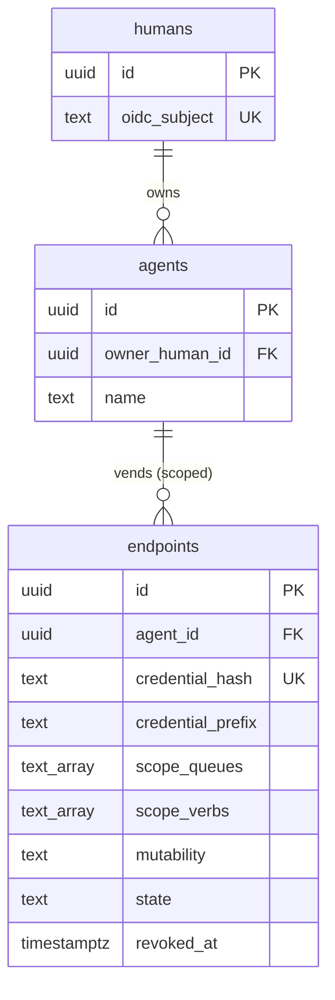

# Design: Vended MCP Endpoints

## Context

Switchboard's core object is a durable todo ([ADR-0007](../../../adrs/ADR-0007-todos-as-core-primitive.md))
that agents claim and complete. Agents are numerous, disposable, and untrusted; humans are few,
durable, and accountable. This capability answers *who an agent is*, *who is accountable for it*, and
*how it is granted a scoped slice of switchboard* — realizing
[ADR-0008](../../../adrs/ADR-0008-human-principal-vended-endpoints.md) and formalized in
[SPEC-0007](spec.md).

The MVP is already implemented. The access model is: a human authenticates via OIDC
([SPEC-0008](../identity/spec.md)), registers agents (`internal/store/agents.go` `CreateAgent`), and
vends each agent a scoped endpoint. Vending mints a credential in `internal/cred/cred.go`, persists
only its hash via `CreateEndpoint`, and shows the plaintext once (`internal/web/templates/vended.html`).
The agent-facing surface (`internal/agentapi/agentapi.go`) authenticates each call by hashing the
presented bearer token and resolving it to an `active` endpoint (`EndpointByCredHash`), then enforces
the endpoint's queue+verb scope at the boundary. Routes are wired in `internal/server/server.go`
(`/agent/*` for agents, `/agents/*` and `/endpoints/*` for the human UI). The schema lives in
`internal/db/migrations/0001_init.sql` (`agents`, `endpoints`).

## Goals / Non-Goals

### Goals

- Every agent action traces to exactly one accountable human owner.
- The vended endpoint (URL + credential) *is* the capability grant; scope travels with it.
- Least privilege by construction: an endpoint can do only its allowlisted verbs on its granted queues.
- Credentials stored hashed only; plaintext shown exactly once.
- Revocation is one instant, total operation with no residue.
- No agent identity ever exists in the identity provider.

### Non-Goals

- Human authentication itself (OIDC login/session) — owned by [SPEC-0008](../identity/spec.md).
- Persona sub-scoping of an agent's vended tools ([ADR-0009](../../../adrs/ADR-0009-personas-as-scoped-agent-cards.md)).
- Cross-agent friending / approval-is-vend ([ADR-0010](../../../adrs/ADR-0010-a2a-discovery-human-vended-friending.md)).
- Agent webhook self-management within a ceiling ([ADR-0012](../../../adrs/ADR-0012-agents-self-manage-webhooks.md)).
- An external secret manager — credentials live hashed in switchboard's own PostgreSQL.

## Decisions

### Human principal + per-agent vended endpoints

**Choice**: Humans are the only principals/tenants; each agent gets a scoped MCP endpoint (URL +
credential) that is the capability grant.
**Rationale**: keeps accountability (every action → one human), least privilege, clean revocation, and
a humans-only IdP all true at once.
**Alternatives considered**:
- Agents as OIDC identities: creates orphan bot identities, bloats Pocket ID, muddies "who did this";
  Pocket ID is passkey-only and humans-oriented — bots don't fit.
- One shared service token: trivial, but no per-agent scoping, revocation, or traceability; one leak
  compromises everything.

### Credential = high-entropy token, stored as SHA-256 hash

**Choice**: Mint `sbk_<base64url(32 bytes)>`, store only `SHA-256(token)` hex + a display prefix,
resolve calls by hashing the presented token.
**Rationale**: high-entropy tokens don't need a slow password hash; SHA-256 + constant-time lookup is
the correct API-token primitive. Plaintext shown once matches how humans copy API keys.
**Alternatives considered**:
- bcrypt/argon2: designed for low-entropy human passwords; unnecessary cost per request for a 256-bit
  random token.
- Storing plaintext or reversible ciphertext: rejected — a database read would leak live credentials.

### Immutable scope by default (revoke-and-re-vend)

**Choice**: default `mutability = immutable`; change access by revoking and vending anew.
**Rationale**: a URL+credential that always denotes one fixed power set is far simpler to audit — no
"when/who changed this scope" question. Revocation is always available.
**Alternatives considered**:
- Mutable-in-place scope: more convenient for incremental tweaks, but reintroduces the audit ambiguity
  immutability removes. Recorded as an open question (below).

### Scope resolved server-side from the credential

**Choice**: The effective scope is read from the stored endpoint (`EndpointByCredHash` → queues +
verbs), never from request-supplied values.
**Rationale**: an agent must not be able to widen its own grant; the credential alone determines
authority.

## Architecture

The vending path is human-driven; the enforcement path is credential-driven. The two never cross: the
`/agent` surface is bearer-authenticated and cookie-free, while `/agents` and `/endpoints` are
session-authenticated and ownership-guarded.

Vended-endpoint authentication + scope enforcement, per agent call:

```mermaid
sequenceDiagram
    participant Agent
    participant AgentAPI as /agent (agentapi)
    participant Store as store (PostgreSQL)
    Agent->>AgentAPI: HTTP + Authorization: Bearer sbk_...
    AgentAPI->>AgentAPI: extract bearer; if empty → 401 unauthenticated
    AgentAPI->>AgentAPI: cred.Hash(token) = SHA-256 hex
    AgentAPI->>Store: EndpointByCredHash(hash) WHERE state='active'
    alt no active endpoint (unknown or revoked)
        Store-->>AgentAPI: ErrNotFound
        AgentAPI-->>Agent: 401 unauthenticated (invalid or revoked)
    else active endpoint
        Store-->>AgentAPI: AuthEndpoint{agent, owner, scopeQueues, scopeVerbs}
        AgentAPI->>AgentAPI: verb in scope.verbs? else 403 forbidden
        AgentAPI->>Store: GetTodo(id)
        AgentAPI->>AgentAPI: todo.queue in scope.queues? else 403 forbidden
        AgentAPI->>Store: Claim/Complete/Fail (owner = agent:<id>)
        Store-->>AgentAPI: updated todo
        AgentAPI-->>Agent: 200 JSON
    end
```

Data model (as implemented in `0001_init.sql`):



Revocation flips `state` to `revoked` (guarded by owner), which drops the row out of the
`EndpointByCredHash` active-only lookup — the credential stops resolving immediately, and the URL is
effectively unrouted because no scope can be built for it.

## Risks / Trade-offs

- **Switchboard runs its own credential mint/store (a mini authorization server)** → accepted cost of
  keeping bots out of the IdP; kept small — one hash column, one active-only lookup, constant-time by
  DB unique index.
- **Immutable scope means re-vend churn on permission changes** → mitigated: scope changes should be
  rare and a re-vend is a single operation; the human copies one new credential.
- **A leaked credential is a live bearer token until revoked** → mitigated by per-agent revocation,
  short-lived credentials, and only-hash-at-rest so a DB read never yields a usable token.
- **SSE stream is lossy by design** (slow subscribers drop events) → acceptable because the durable
  todo queue is the ledger; the stream is only a doorbell ([ADR-0013]).

## Migration Plan

Greenfield — no migration. The `agents` and `endpoints` tables ship in `0001_init.sql`. The
immutable-vs-mutable default, if changed, would be a data-compatible column-semantics decision, not a
schema migration.

## Open Questions

- **Immutable vs. mutable scope**: confirm with Joe whether to keep immutable-by-default (change =
  revoke+re-vend) or allow editing a live endpoint's queues/verbs in place. The schema already carries
  a `mutability` column defaulting to `immutable`; mutable is more convenient but reintroduces audit
  ambiguity ([ADR-0008](../../../adrs/ADR-0008-human-principal-vended-endpoints.md)).
- **Credential lifetime/rotation**: ADR-0008 calls credentials "short-lived," but the MVP endpoint
  record has no explicit expiry column — expiry is currently only via revocation. A TTL/auto-expiry
  column is a candidate future hardening.
- **Native per-credential rate limiting** is deferred to a reverse proxy for now; revisit if a single
  compromised credential can generate abusive load before its owner revokes it.
