# Design: Web UI

## Context

SPEC-0012 realizes [ADR-0001](../../../adrs/ADR-0001-web-stack-go-htmx-pico.md): switchboard serves a
small, server-rendered, human-facing UI from the single Go binary alongside the webhook receivers, the
MCP/agent surface, and the SSE stream. The UI is the *operator's board* — log in, register agents, and
vend/revoke the scoped MCP endpoints that agents plug into Claude Code Channels
([ADR-0013](../../../adrs/ADR-0013-channels-push-delivery.md)). The data lives in PostgreSQL
([ADR-0002](../../../adrs/ADR-0002-postgres-persistence-and-retention.md)) behind the same service;
there is no API-first/mobile-client story, so rendering HTML on the server and swapping fragments is
the natural shape.

ADR-0001 fixes the stack: `net/http` + chi (router/middleware), stdlib `html/template` (contextual
auto-escaping, composes with `embed.FS`), HTMX core + `htmx-ext-sse` (vendored, not CDN), Pico.css
classless + a small `tokens.css` palette, and inline SVG icons (Lucide for chrome, Simple Icons for
brands). SSE is a plain `http.Flusher` handler — no library. Everything ships embedded in the binary
via `embed.FS`; there is no Node build. The implementation is `internal/web/web.go` (handlers +
templates under `internal/web/templates/`) and `internal/server/server.go` (route wiring, static/embed
serving, `RequireHuman` grouping, and the background lease reaper). Authentication is OIDC against
Pocket ID with an `HttpOnly`/`SameSite=Lax`/`Secure`-when-TLS session cookie, plus a dev-only local
login (`internal/auth/auth.go`).

## Goals / Non-Goals

### Goals

- One binary, one PostgreSQL pool, several surfaces — the web layer composes cleanly with the
  long-lived MCP server and background goroutines.
- Live-updating screens with near-zero client state: SSE + HTMX fragment swaps, no SPA, no bundler.
- Offline/CSP-friendly single-binary operation: all assets vendored and embedded.
- Accessible and themeable for near-zero effort: semantic HTML, classless CSS, `currentColor` inline
  SVG, WCAG 2.1 AA.

### Non-Goals

- A JSON API for a client-side framework (rejected in ADR-0001 — screens are server-rendered tables).
- A CSS utility/design system (Tailwind/Bootstrap rejected — Pico classless + a token layer).
- A CDN or runtime-fetched assets (vendored/embedded instead).
- Multi-tenant admin surfaces beyond the four MVP screens.

## Decisions

### `net/http` + chi + stdlib `html/template` over a framework/SPA

**Choice**: Standard library HTTP with chi for routing/middleware, stdlib `html/template` for
rendering, HTMX for interactivity.
**Rationale**: The HTTP surface is webhook receivers (raw body + HMAC) and server-rendered HTML —
neither benefits from a framework's binding/validation or a SPA's JSON API. `html/template` gives
contextual auto-escaping for free and composes with `embed.FS`.
**Alternatives considered**:
- Gin/Echo/Fiber: rejected — framework request/response model is overhead; Fiber's fasthttp
  complicates SSE and stdlib/MCP-SDK interop.
- React/Vue/Svelte SPA: rejected — forces a JSON API, a bundler, and client/server state duplication
  for server-rendered tables.
- templ/quicktemplate: rejected — adds a codegen step not warranted at this screen count.

### SSE via `http.Flusher`, no library; degrade gracefully

**Choice**: Live updates over a plain `net/http` SSE handler using `http.Flusher`, subscribed from the
DOM by `htmx-ext-sse`; a missed event is non-fatal because PostgreSQL is authoritative.
**Rationale**: A few dozen lines of stdlib gives live screens with no client-side state and no SSE
dependency. Treating SSE as best-effort presentation keeps the UI correct on reload.
**Alternatives considered**:
- WebSockets / an SSE library: rejected — heavier than needed for one-way status/log fan-out.

### Vendored + embedded assets (`embed.FS`), CSP-friendly

**Choice**: HTMX core, `htmx-ext-sse`, Pico.css, `tokens.css`, and inline SVG icons are vendored under
`static/` and embedded; served from `embed.FS`, never a CDN.
**Rationale**: Single-binary, offline-friendly, and compatible with a strict `default-src 'self'` CSP.
**Alternatives considered**:
- CDN-loaded assets: rejected — breaks offline/CSP and adds an external dependency.

### Ownership checks + auth-by-default grouping

**Choice**: Authenticated routes are grouped behind `RequireHuman`; agent/endpoint handlers re-check
ownership (`GetAgentOwned`, owner-scoped revoke) and return 404 for non-owned resources.
**Rationale**: Auth-by-default with per-resource ownership prevents horizontal privilege escalation and
avoids leaking existence of another human's agents.
**Alternatives considered**:
- Trusting the session alone without per-resource ownership: rejected — would allow cross-tenant
  reads/writes by id guessing.

## Architecture

One chi router serves webhooks, the vended agent API, auth endpoints, the human UI (behind
`RequireHuman`), static assets, and health. UI handlers read the authenticated human from context,
query the store, and render an embedded `layout` + per-page `content` template. The browser drives
navigation with HTMX fragment GET/POST and subscribes live regions to the SSE stream; all assets load
from `embed.FS`.

```mermaid
flowchart TB
  browser([Browser])

  subgraph proc[Single Go binary — net/http + chi]
    direction TB
    static[/GET /static/* → embed.FS: HTMX, Pico.css, tokens.css, inline SVG/]
    health[/GET /healthz → DB ping/]

    subgraph public[Public auth + login]
      login[/GET /login → login.html/]
      alogin[/GET /auth/login → OIDC redirect/]
      acb[/GET /auth/callback → state check → session cookie/]
      dev[/POST /auth/dev-login → dev only/]
      logout[/GET /logout → clear cookie/]
    end

    subgraph guarded[RequireHuman group]
      dash[/GET / → dashboard.html — human's agents/]
      cAgent[/POST /agents → create → redirect/]
      agent[/GET /agents/&#123;id&#125; → agent.html owned-only, 404 if not/]
      vend[/POST /agents/&#123;id&#125;/vend → mint, one-time reveal → vended.html/]
      revoke[/POST /endpoints/&#123;id&#125;/revoke → owner-scoped/]
    end

    sse[/SSE stream → http.Flusher, best-effort/]
    store[(PostgreSQL — authoritative; ADR-0002)]
    tmpl[[html/template: layout + content, embed.FS]]

    dash --> store
    agent --> store
    vend --> store
    revoke --> store
    dash --> tmpl
    agent --> tmpl
    vend --> tmpl
    login --> tmpl
    sse -. reads .- store
  end

  browser -->|HTMX fragment GET/POST| guarded
  browser -->|htmx-ext-sse subscribe| sse
  browser -->|assets| static
  acb -->|Set-Cookie sb_session HttpOnly/Lax/Secure| browser
  browser -->|session cookie| guarded
```

## Risks / Trade-offs

- **HTMX is less familiar than React to some contributors** → Accepted for a single-maintainer service
  where simplicity and no build step win.
- **Vendored assets must be updated by hand (no CDN auto-refresh)** → Accepted as the price of
  offline/CSP-friendly single-binary operation; assets are pinned under `static/`.
- **SSE is best-effort** → A missed event never corrupts state because PostgreSQL is authoritative and
  a reload reflects current truth.
- **Dev login bypasses OIDC** → MUST be enabled only when `SWITCHBOARD_DEV_LOGIN` is set and MUST NOT
  be present in production; the login page labels it a dev-only bypass.
- **Inline styles/SVG require `style-src 'unsafe-inline'`** → Accepted; a stricter nonce-based CSP is a
  possible future hardening (see Open Questions).

## Migration Plan

Greenfield — the MVP web UI is already built (`internal/web/`, templates, routes in
`internal/server/server.go`). No data migration. Hardening items called out in the spec (security
headers middleware, `http.MaxBytesReader` on form handlers, a synchronizer CSRF token, `Referer`
validation on revoke, and `aria-live`/landmark ARIA attributes on templates) are forward, additive
changes to the existing handlers/templates and MUST NOT alter the route set or data model.

## Open Questions

- **CSRF token mechanism**: adopt a synchronizer-token library vs. hand-rolled per-session token; and
  whether `SameSite=Lax` alone is deemed sufficient for the single-operator MVP before the token lands.
- **Strict CSP**: can inline `<style>` and inline SVG be moved to embedded external files with a
  nonce-based CSP to drop `style-src 'unsafe-inline'`?
- **SSE surface**: which live regions (status strip, event log) subscribe to the stream in the MVP UI,
  and what events the hub publishes to the human audience vs. the agent audience.
- **Theme toggle**: the palette supports bakelite-dark and operator-cream; whether/how to expose a
  user-facing theme switch while preserving WCAG AA contrast in both.
