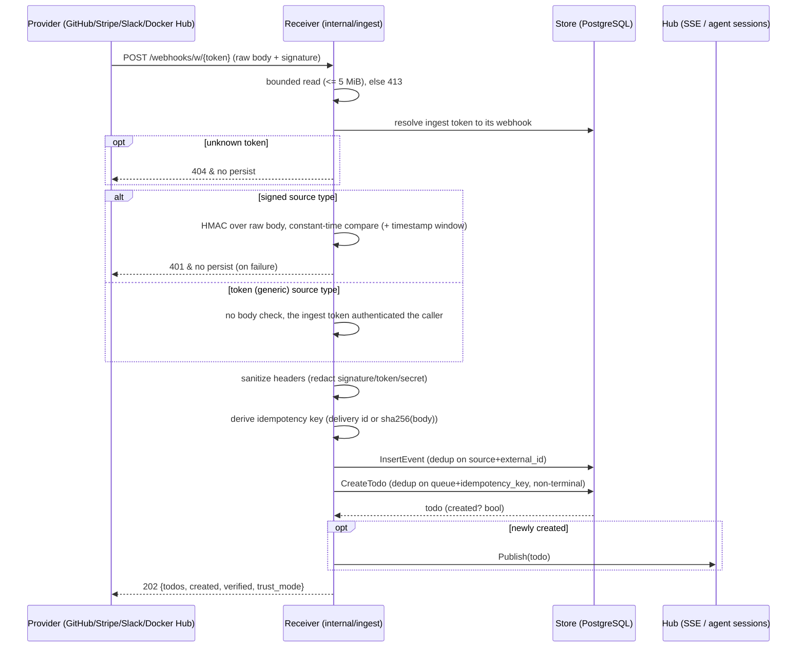

# Design: Webhook Ingestion (Push Adapters)

## Context

> **Amended 2026-09-21, with the shared-receiver removal.** The operator-configured receivers (`/webhooks/{provider}`,
> `/webhooks/generic/{name}`), their env-configured secrets and tokens, the `open` trust mode they
> alone could produce, and pull ingestion (SPEC-0002, retired) were removed. Every delivery arrives
> at a self-managed webhook, `POST /webhooks/w/{ingest_token}`
> ([ADR-0012](../../../adrs/ADR-0012-agents-self-manage-webhooks.md)); the verification decisions
> below are unchanged.

Switchboard ingests external deliveries and turns them into durable todos that human-owned agents
drain. This design realizes the **push** half of that pipeline — HTTP webhook receivers — for
SPEC-0001. It is governed by two ADRs:

- [ADR-0003](../../../adrs/ADR-0003-per-provider-ingestion-and-trust-model.md) fixes the trust model:
  the `webhook` provider family and its ordered trust modes `signed` (HMAC verified, `verified=true`),
  `token` (shared-secret, caller authenticated, `verified=false`), and `open` (no check, off by
  default).
- [ADR-0014](../../../adrs/ADR-0014-ingestion-adapters-push-pull.md) (superseded) framed ingestion
  as **adapters** in two families (push/pull) sharing one back-half contract into the todo queue.
  Webhooks were the push family; the pull family was removed.

Current state: the receiver is `internal/ingest/selfmanaged.go`, wired at
`POST /webhooks/w/{token}` in `internal/server/server.go`; the per-provider verifiers (GitHub, Gitea,
Stripe, Slack, Cairn) live beside it in `internal/ingest`. Events persist to the `events` table and
todos to the `todos` table, in one transaction per delivery (`internal/store`).

Constraints: verification runs on the **raw body before parsing** (re-serialization breaks the HMAC);
comparisons are constant-time; secrets are never logged or persisted; and every accepted delivery
flows through the identical `verify → derive idempotency key → normalize → create todo (dedup) →
persist event` back half.

## Goals / Non-Goals

### Goals

- Receive provider webhooks over HTTP and verify each per its declared trust mode.
- Fail closed for `signed`: a bad/missing signature is 401 and nothing is persisted.
- Give unsigned webhooks a real, honest auth story (`token`) that is default-required and clearly
  weaker than `signed`.
- Dedup redeliveries into exactly one todo via an idempotency key.
- Normalize every accepted delivery to one todo shape, whatever its source type.
- Redact all secret-bearing headers before persisting event history.

### Non-Goals

- The todo lifecycle after creation (claim / lease / complete / fail) — that is the todos capability.
- Agent self-management of webhooks under a ceiling — ADR-0012 / the agent-mcp-tools capability.
- Routing-rule configuration UI — the routing-rule schema is shared and referenced, not owned here.

## Decisions

### Verify the raw body before parsing

**Choice**: Read the body with a bounded limiting reader, then verify the provider signature or token
over those exact bytes *before* JSON parsing.
**Rationale**: HMAC is computed over the raw bytes the sender signed; any parse-and-re-serialize
changes whitespace/ordering and breaks the signature. Verifying first also means a forged/oversized
delivery never reaches the parser or the store.
**Alternatives considered**:
- Parse then verify: rejected — re-serialization invalidates the HMAC and wastes work on forged input.

### Fail closed on signed rejection (401, no persist)

**Choice**: A missing/malformed/failing signature returns 401 and writes no event and no todo; only a
redacted line is logged.
**Rationale**: Persisting flagged-unverified rows would let an attacker fill the audit log with
unauthenticated payloads and muddy the trust surface. Failing closed keeps forged deliveries out of
the store entirely.
**Alternatives considered**:
- Persist with `verified=false`: rejected by ADR-0003 — pollutes history, invites log-flooding.

### `token` as a distinct, weaker tier for unsigned providers

**Choice**: Unsigned providers (Docker Hub, homelab) use a `generic` webhook, whose shared secret is
the unguessable ingest token switchboard mints into the URL path; persisted as
`trust_mode='token'`, `verified=false`.
**Rationale**: It is the honest answer to "can they set a password?" — the token authenticates the
caller but not the body and has no replay resistance, so it must never render as `signed`. Making it
default-required keeps homelab endpoints from being silently world-writable.
**Alternatives considered**:
- Open by default: rejected — every unsigned endpoint would be world-writable.
- Fabricate an HMAC scheme the provider lacks: rejected — a lie encoded in the trust UI.

### Idempotency key from provider delivery id, body-hash fallback

**Choice**: Derive the key from a provider delivery id where present (GitHub `X-GitHub-Delivery`,
Stripe event `id`) and fall back to `sha256(body)` where absent (Slack, generic). Dedup todos on
`(queue, idempotency_key)` among non-terminal rows; dedup events on `(source, external_id)`.
**Rationale**: Provider ids are the strongest dedup signal; a body hash is the best available where no
id exists. This collapses at-least-once sender retries into one todo.
**Alternatives considered**:
- Always body-hash: rejected — misses semantically-distinct redeliveries a provider id would separate.

## Architecture

A webhook receiver runs the **front half** (transport verification) unique to its trust mode, then
the **shared back half** identical to every adapter. The front half diverges by trust mode; the back
half — `InsertEvent` then `CreateTodo` (dedup) then hub publish — is common.

Trust-mode outcomes map directly to the `events` columns (`family`, `trust_mode`, `verified`,
`verify_detail`) and drive labeling everywhere:

| Trust mode | Verified by | `verified` | `verify_detail` | Failure |
|------------|-------------|-----------|-----------------|---------|
| `signed` | per-provider HMAC over raw body (+ ts window for Stripe/Slack) | `true` | `hmac-sha256 ok` | 401, no persist |
| `token` | unguessable ingest token in the URL path | `false` | `self-managed token webhook; caller authenticated by unguessable ingest URL; body not verified` | 404, no persist |

## Risks / Trade-offs

- **`token` has no replay protection (same secret every request)** → labeled distinctly from `signed`,
  `verify_detail` states body-not-verified; prefer signed providers where available.
- **Body-hash idempotency keys collide across semantically-distinct identical bodies** → accepted for
  providers with no delivery id; the `(source, external_id)` event dedup and per-queue scoping bound
  the blast radius.
- **Operators must understand two trust values, not "webhooks are secure"** → prominent UI labeling
  and ADR-0003 on the record.

## Migration Plan

None outstanding. A new source type adds a verifier in `internal/ingest` and a source-type →
trust-mode entry in `internal/mcp/webhooks.go`; it needs no schema migration.

## Open Questions

- The MVP `internal/ingest/ingest.go` uses `io.LimitReader` (silently truncates at 5 MiB) rather than
  `http.MaxBytesReader` (returns an explicit 413). SPEC-0001 requires the 413 semantics; the code
  SHOULD move to `http.MaxBytesReader` for a clean oversize rejection.
- Slack `url_verification` handshake (echo the `challenge`, 200, persist nothing) is specified in
  `openapi.yaml` but not yet implemented in the reference receiver.
