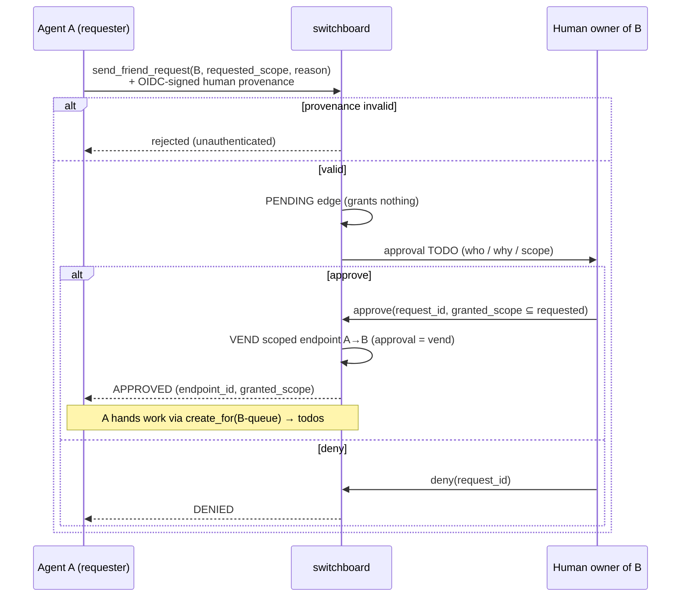

# switchboard — Friend-Request & Approval Flow

The end-to-end sequence by which one agent gains scoped access to hand work to another, governed by
human vending. Decisions are in [ADR-010](../adr/ADR-010-a2a-discovery-human-vended-friending.md);
provenance/assurance in [ADR-011](../adr/ADR-011-identity-assurance-oidc-passkey-deferred.md); the verbs
in the [agent-mcp-tools spec](agent-mcp-tools.md); what gets discovered in the
[personas-and-agent-cards spec](personas-and-agent-cards.md).

## The flow

```
discover → request(scope) → PENDING edge → human approval TODO → approve/narrow (= VEND) → work as todos
```

1. **Discover.** Agent A finds persona B via A2A within a **bounded directory**
   ([personas-and-agent-cards spec](personas-and-agent-cards.md)).
2. **Request.** A calls `send_friend_request(target=B, requested_scope, reason)` with **OIDC-signed
   provenance of the requesting human** ([ADR-011](../adr/ADR-011-identity-assurance-oidc-passkey-deferred.md)).
   → creates a **PENDING edge** that **grants nothing**.
3. **Approval todo.** The request is delivered as a **todo in B's owner's queue** — switchboard
   dogfooding its own primitive ([ADR-007](../adr/ADR-007-todos-as-core-primitive.md)) — carrying a
   crisp **who / why / requested-scope** summary.
4. **Approve = vend.** B's **human** calls `approve(request_id, granted_scope?)`, optionally
   **narrowing** the scope. Approval **mints the scoped MCP endpoint**
   ([ADR-008](../adr/ADR-008-human-principal-vended-endpoints.md)) granting A the approved access to B.
   (Or `deny` — no grant.)
5. **Work as todos.** A now hands B work via `create_for(B-queue, …)` — durable, owned, dedup'd todos
   ([todos spec](todos.md)) — **never** via A2A direct peer tasks
   ([ADR-010](../adr/ADR-010-a2a-discovery-human-vended-friending.md)).

## Edge states

```
   send_friend_request
        │  (+ OIDC-signed human provenance; else → rejected)
        ▼
     PENDING ──── approve (+ optional narrow) ───▶ APPROVED  (endpoint vended, access live)
        │                                              │
        │ deny                                         │ revoke  (kill vended endpoint)
        ▼                                              ▼
     DENIED                                         REVOKED
```

| State | Grants access? | Notes |
|-------|----------------|-------|
| `pending` | **No** | Edge exists; awaiting human decision. Confers nothing. |
| `approved` | **Yes** | Scoped endpoint vended; A→B access live at `granted_scope`. |
| `denied` | No | Terminal; A may re-request subject to quotas. |
| `revoked` | No | Endpoint killed; access gone instantly. |

## Approval-request (todo) shape

The approval todo (in B-owner's queue) carries:

```json
{
  "type": "object",
  "required": ["request_id", "from_human", "from_persona", "to_persona", "requested_scope", "reason", "provenance_verified"],
  "properties": {
    "request_id":     { "type": "string" },
    "from_human":     { "type": "string", "description": "OIDC subject of the REQUESTING human (attested, not self-asserted)." },
    "from_persona":   { "type": "string", "description": "Requesting persona/agent." },
    "to_persona":     { "type": "string", "description": "Target persona (B)." },
    "requested_scope":{ "type": "object", "properties": {
                          "queues": { "type": "array", "items": { "type": "string" } },
                          "verbs":  { "type": "array", "items": { "type": "string" } } } },
    "reason":         { "type": "string", "description": "Why — the who/why/scope summary shown to the approver." },
    "provenance_verified": { "type": "boolean", "description": "true only if OIDC-signed human provenance validated (ADR-011)." }
  }
}
```

## Grant rules

- **Approval is the vend.** There is no separate vend step; approving mints the endpoint
  ([ADR-008](../adr/ADR-008-human-principal-vended-endpoints.md)).
- **Narrow-only at approval.** `granted_scope` MUST be ⊆ `requested_scope`. The human can hand back
  less than asked, never more.
- **Per-direction.** A→B and B→A are **separate** grants. Approving A's request to hand *you* work does
  not let you hand *A* work; that needs its own request/approval.
- **Revocable.** `revoke(edge_id)` kills the vended endpoint instantly and one-sidedly
  ([ADR-008](../adr/ADR-008-human-principal-vended-endpoints.md)).
- **Non-transitive.** Friending B reveals nothing about B's other friends, B's other personas, or B's
  queues beyond the granted one. Each edge is opaque to every other
  ([ADR-010](../adr/ADR-010-a2a-discovery-human-vended-friending.md)).

## Anti-spam

- **Bounded directories** — discovery is limited to a known set, not the open internet.
- **Quotas / rate limits** — friend requests are capped per requester to blunt flooding.
- **Legible approvals** — every approval todo shows a crisp who/why/scope summary.
- **Verifiable provenance** — a request without valid OIDC-signed human provenance is rejected
  (`unauthenticated`), so the approver always evaluates a **real, attested** counterparty
  ([ADR-011](../adr/ADR-011-identity-assurance-oidc-passkey-deferred.md)).

## Provenance & the deferred hardening

Today switchboard **trusts the Pocket ID issuer** and does **not** enforce `amr`/`acr` step-up on
approvals, because Pocket ID is passkey-only so approvals are passkey-backed by construction
([ADR-011](../adr/ADR-011-identity-assurance-oidc-passkey-deferred.md)).

> **Deferred hardening (recorded, not silent):** before switchboard federates to / accepts provenance
> from **any non-passkey IdP**, it MUST require a **phishing-resistant `amr`/`acr` claim** on friend
> approvals — issuer-trust stops being sufficient once a non-passkey issuer is in the trust set. The
> exact `amr` value/`acr` level is TBD (there is no standard "passkey" `amr`; see
> [ADR-011](../adr/ADR-011-identity-assurance-oidc-passkey-deferred.md)). Tracked in
> [docs/README.md](../README.md) open-questions.

## Sequence



## Cross-references

- Split-by-strength & the friending decision: [ADR-010](../adr/ADR-010-a2a-discovery-human-vended-friending.md).
- Vend = approval, per-direction, revocation: [ADR-008](../adr/ADR-008-human-principal-vended-endpoints.md), [accounts-and-endpoints spec](accounts-and-endpoints.md).
- Provenance/assurance & deferred hardening: [ADR-011](../adr/ADR-011-identity-assurance-oidc-passkey-deferred.md).
- Verbs: [agent-mcp-tools spec](agent-mcp-tools.md). Approval todo is a todo: [todos spec](todos.md).
- What is discovered: [personas-and-agent-cards spec](personas-and-agent-cards.md).
